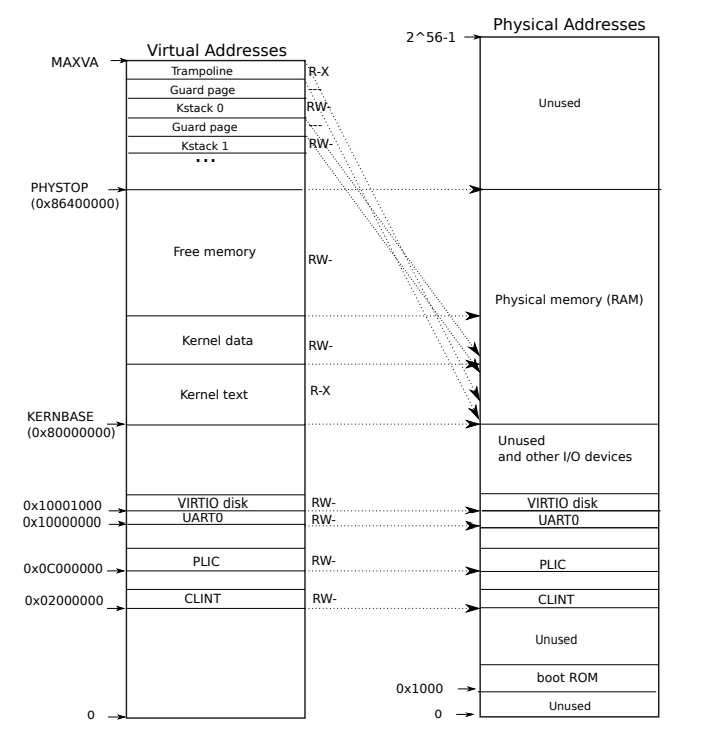

# COW-Lab

## The problem

xv6的系统调用`fork`是将父进程的整个地址空间拷贝一份到子进程，而如果父进程地址空间太大，拷贝将花费大量时间。更糟的是，这些拷贝工作通常是无用功，因为`fork`后通常会调用`exec`，导致子进程将拷贝的内存丢弃

另一方面，如果父进程或者子进程需要写入某一页，那么对于该页的拷贝又是必须的

## The solution

COW的目的是推迟子进程物理内存的分配和拷贝，直到真正需要用到它时

COW为子进程创建一个页表，和父进程的页表映射到同样的物理页，但是会将父子进程的PTE条目标记为不可写；当父进程或者子进程其中一个尝试写入这些页时，就会导致缺页异常；内核检测到缺页异常，为对应进程分配一个新的物理页，将那个不可写的物理页内容拷贝到这，修改对应PTE条目，将其映射到这个新的物理页，并且标记置为可写；当从缺页异常处理程序返回时，发生异常的进程可以继续执行

COW使得正确释放进程占用物理页变得更加有技巧性，因为一个物理页可能被多个进程的页表映射，当且仅当最后一个对该物理页的引用消失时，才将该物理页释放(类似引用计数)

## _Implement copy-on write (<font color=ff0000><u>hard.</u></font>)_

对每个物理页设置一个引用计数，只有引用计数为0时才释放该物理页

由下图可知，RAM的范围是`KERNBASE~PHYSTOP`，可以使用一个数组来记录范围内的每一个物理页的引用计数



在`kernel/kalloc.c`添加数组`refcnt`来记录每个物理页的引用计数

```c
int refcnt[(PHYSTOP - KERNBASE) / PGSIZE];
```

先实现几个之后可能会用到的函数

`pageindex`根据物理地址计算对应`refcnt`数组的下标值

```c
int
pageindex(uint64 pa)
{
    return (pa - KERNBASE) / PGSIZE;
}
```

`getrefcnt`来获得某个物理页的引用计数

```c
int
getrefcnt(uint64 pa)
{
  return refcnt[pageindex(pa)];
}
```

`refincr`增加某个物理页的引用计数，`refdecr`相反

```c
void
refincr(uint64 pa)
{
    refcnt[pageindex(pa)] += 1;
}

void
refdecr(uint64 pa)
{
    refcnt[pageindex(pa)] -= 1;
}
```

最开始`kinit`调用了`freerange`将所有物理页加入空闲链表中，在`freerange`中将引用计数初始化为1(因为之后会对每个物理页调用`kfree`，而`kfree`会先将引用计数减1，如果为0就加入空闲链表)

```c
void
freerange(void *pa_start, void *pa_end)
{
    char *p;
    p = (char*)PGROUNDUP((uint64)pa_start);
    for(; p + PGSIZE <= (char*)pa_end; p += PGSIZE) {
        // 初始化引用计数为1
        refcnt[pageindex((uint64)p)] = 1;
        kfree(p);
    }
}
```

修改`kalloc`，当某个物理页面被分配时，将其引用计数置为1

```c
void *
kalloc(void)
{
    struct run *r;

    acquire(&kmem.lock);
    r = kmem.freelist;
    if(r) {
        // 分配某个物理页面时，将其从空闲链表中移除，并置引用计数为1
        kmem.freelist = r->next;
        refcnt[pageindex((uint64)r)] = 1;
    }
    release(&kmem.lock);

    if(r)
        memset((char*)r, 5, PGSIZE); // fill with junk

    return (void*)r;
}
```

修改`kfree`，将要释放的物理页面引用计数减1，如果减完后为0，将该物理页加入空闲链表

```c
void
kfree(void *pa)
{
    struct run *r;

    if(((uint64)pa % PGSIZE) != 0 || (char*)pa < end || (uint64)pa >= PHYSTOP)
        panic("kfree");

   	// 由于多个CPU可能同时执行kfree释放同一个物理页，需要加锁
    acquire(&kmem.lock);
    int cnt = getrefcnt((uint64)pa);
    refdecr((uint64)pa);
    release(&kmem.lock);
	
    // 引用计数减1后为0，才执行下面代码来将物理页加入空闲链表
    if (cnt > 1)
        return;

    // Fill with junk to catch dangling refs.
    memset(pa, 1, PGSIZE);

    r = (struct run*)pa;

    acquire(&kmem.lock);
    r->next = kmem.freelist;
    kmem.freelist = r;
    release(&kmem.lock);
}
```

当缺页异常发生时，我们需要知道这个异常是不是由COW造成的，因此PTE条目还需要一个标志位，正好xv6的页表条目剩余两个保留位，在`kernel/riscv.h`中添加下面声明

```c
#define PTE_COW (1L << 8)
```

修改`uvmcopy`，让子进程的映射指向父进程的物理页并将其引用计数加1，而不是新分配一个物理页，去掉父子进程对该页的写权限并且标明它是一个COW物理页

```c
int
uvmcopy(pagetable_t old, pagetable_t new, uint64 sz)
{
    pte_t *pte;
    uint64 pa, i;
    uint flags;
    // char *mem;

    for(i = 0; i < sz; i += PGSIZE){
        if((pte = walk(old, i, 0)) == 0)
            panic("uvmcopy: pte should exist");
        if((*pte & PTE_V) == 0)
            panic("uvmcopy: page not present");
        pa = PTE2PA(*pte);
        // 写保护，并表明是一个cow页
        *pte = (*pte & ~PTE_W) | PTE_COW;
        flags = PTE_FLAGS(*pte);
        // pa这个物理页引用计数加1
        refincr(pa);
        if(mappages(new, i, PGSIZE, pa, flags) != 0){
            goto err;
        }
    }
    return 0;

    err:
    uvmunmap(new, 0, i / PGSIZE, 1);
    return -1;
}
```

在`kernel/trap.c`中实现函数`cowfault`来处理缺页异常

```c
int
cowfault(pagetable_t pagetable, uint64 va)
{
    pte_t *pte;
    uint64 pa;
    char *mem;
    int flags;

    // va可能是个非常大的非法地址，过滤掉防止walk内panic
    if (va >= MAXVA)
        return -1;

    pte = walk(pagetable, va, 0);
    // 利用pte判断，如果va是TRAMPOLINE, TRAPFRAME或者gurad page，过滤掉
    if (pte == 0)
        return -1;
    if ((*pte & PTE_U) == 0 || (*pte & PTE_V) == 0)
        return -1;
    if ((*pte & PTE_COW) == 0)
        return -1;

    // 新分配一个页面，并将原页面拷贝到此
    pa = PTE2PA(*pte);
    mem = (char *)kalloc();
    if (mem == 0)
        return -1;
    memmove(mem, (char *)pa, PGSIZE);

    // 将pte映射到这个新分配的页面
    flags = PTE_FLAGS(*pte);
    flags = (flags & ~PTE_COW) | PTE_W;
    *pte = PA2PTE((uint64)mem) | flags;

    // 原页面引用计数减1
    kfree((char *)pa);

    return 0;
}
```

在`usertrap`中对COW造成的缺页异常做处理，由于是无法写入导致的缺页，只需对`scause`为15做处理


```c
void
usertrap(void)
{
    ...
    
    else if(r_scause() == 15) {
    	if (cowfault(p->pagetable, r_stval()) < 0)
            p->killed = 1;
    }
    
    ...
}
```

另外和上次实验一样`copyout`也会导致缺页(`copyin`不会，因为是无法写入但可以读)，`copyout`本身就是在内核中执行的，无法交给`usertrap`处理，所以修改`copyout`

```c
int
copyout(pagetable_t pagetable, uint64 dstva, char *src, uint64 len)
{
    uint64 n, va0, pa0;

    while(len > 0){
        va0 = PGROUNDDOWN(dstva);

        // 过滤非法地址
        if (va0 >= MAXVA)
            return -1;
        pte_t *pte = walk(pagetable, va0, 0);
        if (pte == 0 || (*pte & PTE_V) == 0 || (*pte & PTE_U) == 0)
            return -1;

        // 对cow页做处理
        if (*pte & PTE_COW) {
            if (cowfault(pagetable, va0) < 0)
                return -1;
        }

        pa0 = PTE2PA(*pte);
        if(pa0 == 0)
            return -1;
        n = PGSIZE - (dstva - va0);
        if(n > len)
            n = len;
        memmove((void *)(pa0 + (dstva - va0)), src, n);

        len -= n;
        src += n;
        dstva = va0 + PGSIZE;
    }
    return 0;
}
```

编译后执行`cowtest`，全部样例通过

```sh
$ cowtest
simple: ok
simple: ok
three: ok
three: ok
three: ok
file: ok
ALL COW TESTS PASSED
```

执行`usertests`，全部样例通过

```sh
$ usertests
usertests starting
test execout: OK
test copyin: OK
test copyout: OK
...
test forktest: OK
test bigdir: OK
ALL TESTS PASSED
```

最后`make grade`，结果如下

```sh
$ make qemu-gdb
(24.2s)
== Test   simple ==
  simple: OK
== Test   three ==
  three: OK
== Test   file ==
  file: OK
== Test usertests ==
$ make qemu-gdb
(172.8s)
== Test   usertests: copyin ==
  usertests: copyin: OK
== Test   usertests: copyout ==
  usertests: copyout: OK
== Test   usertests: all tests ==
  usertests: all tests: OK
== Test time ==
time: OK
Score: 110/110
```

