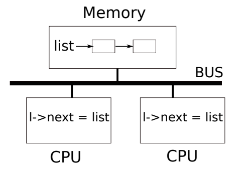
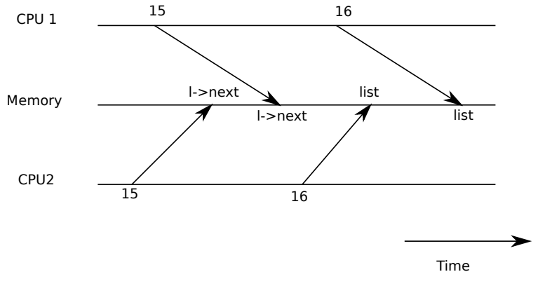
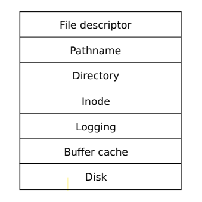
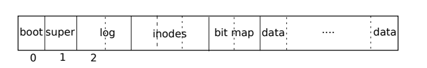

# Lock-Lab

## Locking

大多数操作系统内核(包括xv6)都会交错执行一系列活动，导致交错执行的因素有如下几个:

- 多核处理器硬件。多个CPU独自执行程序，共享物理RAM，这种共享使得一个CPU在读取某个数据而另外一个CPU在修改它，或者两个CPU同时修改某个数据成为可能。如果不小心谨慎设计并发程序，可能导致程序产生错误结果或者损坏数据
- 即使在单处理器上，内核也可能会切换CPU执行的线程，导致它们交错执行
- 设备中断处理程序也可能修改可被中断代码的数据，如果中断来的不是时候，很可能导致数据损坏

**并发(concurrency)**一词指的是由多处理器并行、线程切换或者中断导致的多个指令流交错执行

以并发下正确性为目标的策略，以及支持这些策略的抽象称为**并发控制(concurrency control)**技术。

Xv6有着一系列的并发控制技术，其中使用最广泛的是**锁(lock)**。尽管锁是一种很容易理解的并发控制技术，但锁的缺点是它们会降低性能，因为锁将并发操作串行化了

### Race conditions

有一个例子可以很好地展示为什么我们需要锁，假设有两个进程在调用`wait`回收子进程的内存。因此在每个CPU上，内核会调用`kfree`来释放子进程的物理内存。内核内存分配器维护了一个空闲链表，`kalloc`从链表中弹出一页表示分配，相反`kfree`将一个要回收的物理页加入链表。为了得到最好的性能，我们期望两个进程可以并行地执行`kfree`，而不是一个进程需要等待另外一个进程，然而这种实现方式是错误的

```c
struct {
    struct spinlock lock;
    struct run *freelist;
} kmem;

void *
kalloc(void)
{
    struct run *r;

    acquire(&kmem.lock);
    r = kmem.freelist;
    if(r)
        kmem.freelist = r->next;
    release(&kmem.lock);

    if(r)
        memset((char*)r, 5, PGSIZE); // fill with junk
    return (void*)r;
}

void
kfree(void *pa)
{
    struct run *r;

    if(((uint64)pa % PGSIZE) != 0 || (char*)pa < end || (uint64)pa >= PHYSTOP)
        panic("kfree");

    // Fill with junk to catch dangling refs.
    memset(pa, 1, PGSIZE);

    r = (struct run*)pa;

    acquire(&kmem.lock);
    r->next = kmem.freelist;
    kmem.freelist = r;
    release(&kmem.lock);
}
```

如图所示，内存中的链表被两个CPU共享，CPU通过load/store指令来操作链表。



如果没有并发请求的话，那么一种可能的链表`push`操作如下:

```c
struct element {
    int data;
    struct element *next;
};

struct element *list = 0;

void
push(int data)
{
    struct element *l;
    
    l = malloc(sizeof *l);
    l->data = data;
    l->next = list;
    list = l;
}
```

如果单独执行的话那么这种实现是正确的。但是，如果有两个CPU同时执行`push`，如图所示，在任一CPU执行`line16: list = l`前，它们可能同时执行`line15: l->next = list`，然后就会导致错误的结果。两个CPU会同时将`l->next`指向链表头部，然后先后执行`list = l`，这样后执行的会将前一个的操作覆盖掉，前一个CPU执行的操作将会丢失



第16行代码`list = l`是一种**竞争条件(race condition)**的例子。竞争条件指的是某个内存地址被并发访问，其中至少有一个是写入操作。竞争通常是程序有bug的信号，要么造成更新丢失，要么造成对一个尚未完成更新的数据结构的读取。由竞争引入的bug通常很难复现和调试

通常使用锁来避免竞争。锁保证了**互斥(mutual exclusion)**，所以某时刻只有一个CPU会执行`push`中的敏感代码。引入锁后，`push`的实现改变如下:

```c
struct element {
    int data;
    struct element *next;
};

struct element *list = 0;
struct lock listlock;

void
push(int data)
{
    struct element *l;
    
    l = malloc(sizeof *l);
    l->data = data;
    acquire(&listlock);
    l->next = list;
    list = l;
    release(&listlock);
}
```

在`acquire`和`release`间的代码通常被称为**临界区(critical section)**。

当我们说锁保护了数据的时候，我们真正的意思是锁保护了一些被应用于数据的不变量集合。不变量指的是在操作中维护的数据结构的特性。通常，一个操作的正确行为依赖于操作开始时不变性为真，这个操作可能短暂地违反不变性，但是在完成操作前必须将其恢复。

在链表的例子中，不变性指的是`list`指向链表头部元素和每个元素的`next`指针指向下一个元素。上面`push`的实现短暂地违反了不变性，在第17行`l->next = list`，此时`l`指向了它的下一个元素，但是`list`却没有指向链表头部元素`l`，但这种不变性在稍后(第18行`list = l`)又得到恢复。在链表这个例子中，竞争条件的发生是因为CPU执行代码正确依靠的是上面谈到的不变性，但是显然在`push`中这种不变性被短暂地改变了。合理地运用锁确保了某时刻只有一个CPU能够进入临界区，所以没有CPU能够在不变性为假的时候对数据进行操作

锁将本来并行的临界区串行化了，因此保护了不变性。锁也确保了临界区的操作是原子的

虽然锁的合理使用使得错误的代码变正确了，但是锁限制了性能。比如，如果两个进程能够并发地调用`kfree`，锁的使用会将这两个调用串行化，将这两个调用放在不同CPU上执行时我们没有获得多核带来的优势。当多个进程同一时间要获取锁时，我们说这多个进程**竞争(conflict)**，或者说发生了**锁争用(lock contention)**。

### Code: Locks

Xv6有两种类型的锁: **自旋锁(spinlock)**和**睡眠锁(sleep-lock)**。我们先讲自旋锁，Xv6用结构体`struct spinlock`来表示自旋锁，结构体中最重要的字段是`locked`，当它为0时代表锁可被获得，否则表明锁被持有。逻辑上，xv6应该执行类似下面的代码来获取锁

```c
void
acquire(struct spinlock *lk)
{
    for(;;) {
        if(lk->locked == 0) {
            lk->locked = 1;
            break;
        }
    }
}
```

不幸的是，上面的实现没有确保在多核处理器上的互斥性。可能有两个CPU同时执行到`if(lk->locked == 0)`，发现条件成立，然后同时用`lk->locked = 1`来加锁。这种情况下，两个CPU都持有锁，这违反了互斥性。我们需要一种方法来使得`if(lk->locked == 0)`和`lk->locked = 1`变成一个原子操作

多核处理器通常提供了指令来实现上面的原子操作，在RISC-V机器上这个指令是`amoswap r, a`。`amoswap`读取内存地址`a`上的值，然后将寄存器`r`的内容写入到地址`a`，最后将从`a`上读到的值写入寄存器`r`。也就是将寄存器`r`的值和地址`a`的值交换了，硬件保证了这个操作是原子的

Xv6的`acquire`实现使用了可移植C语言库调用`__sync_lock_test_and_set`，底层实现为`amoswap`指令。`acquire`在循环中调用`__sync_lock_test_and_set(&lk->locked, 1)`来尝试获得锁；调用时如果`lk->locked`为0，那么我们获得了锁，函数将`lk->locked`置1，并返回0，结束while循环；调用时如果`lk->locked`为1，那么说明锁已经被持有，函数将`lk->locked`置1(不改变)，返回1，继续while循环

```c
void
acquire(struct spinlock *lk)
{
    push_off(); // disable interrupts to avoid deadlock.
    if(holding(lk))
        panic("acquire");

    #ifdef LAB_LOCK
    __sync_fetch_and_add(&(lk->n), 1);
    #endif      

    // On RISC-V, sync_lock_test_and_set turns into an atomic swap:
    //   a5 = 1
    //   s1 = &lk->locked
    //   amoswap.w.aq a5, a5, (s1)
    while(__sync_lock_test_and_set(&lk->locked, 1) != 0) {
        #ifdef LAB_LOCK
        __sync_fetch_and_add(&(lk->nts), 1);
        #else
        ;
        #endif
    }

    // Tell the C compiler and the processor to not move loads or stores
    // past this point, to ensure that the critical section's memory
    // references happen strictly after the lock is acquired.
    // On RISC-V, this emits a fence instruction.
    __sync_synchronize();

    // Record info about lock acquisition for holding() and debugging.
    lk->cpu = mycpu();
}
```

为了调试，`lk->cpu`记录了持有锁的CPU，这个字段仅能在持有锁时修改

`release`函数则和`acquire`相反，它清除`lk->cpu`然后释放锁，理论上可以将`lk->locked`置0，但是C语言无法确保操作是原子的，所以`release`调用的是`__sync_lock_release`

```c
// Release the lock.
void
release(struct spinlock *lk)
{
    if(!holding(lk))
        panic("release");

    lk->cpu = 0;

    // Tell the C compiler and the CPU to not move loads or stores
    // past this point, to ensure that all the stores in the critical
    // section are visible to other CPUs before the lock is released,
    // and that loads in the critical section occur strictly before
    // the lock is released.
    // On RISC-V, this emits a fence instruction.
    __sync_synchronize();

    // Release the lock, equivalent to lk->locked = 0.
    // This code doesn't use a C assignment, since the C standard
    // implies that an assignment might be implemented with
    // multiple store instructions.
    // On RISC-V, sync_lock_release turns into an atomic swap:
    //   s1 = &lk->locked
    //   amoswap.w zero, zero, (s1)
    __sync_lock_release(&lk->locked);

    pop_off();
}
```

### Code: Using locks

一个关于应用锁的难点在于如何决定使用锁的数量以及每个锁保护的数据和不变量。有这么几个准测:

- 任何时刻一个CPU要写入某个变量，同一时刻另一个CPU要读/写这个变量，那么需要一个锁来保护该变量
- 如果某个不变量涉及到多个内存地址，需要一个锁来保护所有这些地址来维护不变量

锁会影响程序性能，同样锁的粗细程度也会影响程序性能

一个**粗粒度的(coarse-grained)**锁的例子是，xv6的`kalloc.c`中由一个锁来保护整个空闲链表，多个进程执行在不同CPU上申请内存时，都会尝试获取锁，如果没有获取到就会自旋。自旋降低了性能，可以使用更加细粒度的锁来分别保护多个空闲链表来提升性能

一个**细粒度的(fine-grained)**锁的例子是，xv6对于每个文件都有一个单独的锁，所以不同进程操作不同文件时不用相互等待，甚至锁可以更加细粒化，比如对文件的不同部分设置锁，这样进程可以并发地访问同一文件的不同部分

Xv6的所有锁如下表所示

|       Lock       |                         Description                          |
| :--------------: | :----------------------------------------------------------: |
|   bcache.lock    |      Protects allocation of block buffer cache entries       |
|    cons.lock     | Serializes access to console hardware, avoids intermixed output |
|   ftable.lock    | Serializes access to console hardware, avoids intermixed output |
|   icache.lock    |          Protects allocation of inode cache entries          |
|    vdisk_lock    | Serializes access to disk hardware and queue of DMA descriptors |
|    kmem.lock     |               Serializes allocation of memory                |
|     log.lock     |         Serializes operations on the transaction log         |
| pipe's pi->lock  |              Serializes operations on each pipe              |
|     pid_lock     |              Serializes increments of next_pid               |
|  proc's p->lock  |            Serializes changes to process’s state             |
|    tickslock     |          Serializes operations on the ticks counter          |
| inode's ip->lock |     Serializes operations on each inode and its content      |
|  buf's b->lock   |          Serializes operations on each block buffer          |

### Deadlock and lock ordering

如果某段代码进入内核需要同一时间持有若干锁，那么所有代码路径需要以相同的顺序加锁，否则可能会出现**死锁(deadlock)**。假设有两个线程`T1`和`T2`，`T1`先获取锁`A`，然后获取锁`B`，`T2`先获取锁`B`再获取锁`A`。假设`T1`已经获取锁`A`，且同一时刻`T2`已经获取锁`B`，接下来`T1`尝试获取锁`B`，`T2`尝试获取锁`A`。线程`T1`和`T2`接下来将无限阻塞，因为双方都在等待对方释放自己需要的锁，而释放有需要从无限自旋的`acquire`先返回。为了避免这种死锁，应该以相同的顺序加锁。

由于`sleep`的工作方式，xv6有着许多长度为2的锁顺序链，其中涉及到每个进程的锁。举个例子，`consoleintr`是处理输入字符的中断程序，当换行符输入时，任何等待控制台输入的进程都应该被唤醒。为此，`consoleintr`在调用`wakeup`时持有`cons.lock`，为了唤醒等待进程，`wakeup`会先尝试获取这些进程的锁。因此，全局避免死锁的锁顺序应当包括`cons.lock`必须在获取任何进程锁之前加锁这一规则。

```c
// kernel/console.c
void
consoleintr(int c)
{
    acquire(&cons.lock);

    switch(c){
		...
        default:
            if(c != 0 && cons.e-cons.r < INPUT_BUF){
                c = (c == '\r') ? '\n' : c;

                // echo back to the user.
                consputc(c);

                // store for consumption by consoleread().
                cons.buf[cons.e++ % INPUT_BUF] = c;

                if(c == '\n' || c == C('D') || cons.e == cons.r+INPUT_BUF){
                    // wake up consoleread() if a whole line (or end-of-file)
                    // has arrived.
                    cons.w = cons.e;
                    wakeup(&cons.r);
                }
            }
            break;
    }

    release(&cons.lock);
}
// kernel/proc.c
void
wakeup(void *chan)
{
    struct proc *p;

    for(p = proc; p < &proc[NPROC]; p++) {
        acquire(&p->lock);
        if(p->state == SLEEPING && p->chan == chan) {
            p->state = RUNNABLE;
        }
        release(&p->lock);
    }
}
```

文件系统代码包括了xv6最长的锁链。比如，创建一个文件需要同时获取目录锁、新文件的inode锁、磁盘块缓冲区锁、磁盘驱动锁`vdisk_lock`以及调用进程的锁`p->lock`。为了避免死锁，文件系统代码总是以上面的顺序进行加锁。

### Locks and interrupt handlers

有些xv6的自旋锁保护了同时被线程和中断处理程序使用的数据。比如，时钟中断处理程序`clockintr`可能会增加`ticks`，而同时一个内核线程可能会在`sys_sleep`中读取`ticks`。`tickslock`会串行化对`ticks`的访问

```c
// kernel/trap.c
void
clockintr()
{
    acquire(&tickslock);
    ticks++;
    wakeup(&ticks);
    release(&tickslock);
}

// kernel/sysproc.c
uint64
sys_sleep(void)
{
    int n;
    uint ticks0;

    if(argint(0, &n) < 0)
        return -1;
    acquire(&tickslock);
    ticks0 = ticks;
    while(ticks - ticks0 < n){
        if(myproc()->killed){
            release(&tickslock);
            return -1;
        }
        sleep(&ticks, &tickslock);
    }
    release(&tickslock);
    return 0;
}
```

自旋锁和中断的相互作用可能导致潜在危险。假设`sys_sleep`持有了锁`tickslock`，然后CPU被时钟中断，`clockintr`会尝试获取`tickslock`，会发现已经被获取，然后就会一直自旋直到锁被释放。这种情况下会造成死锁，因为`tickslock`需要`sys_sleep`释放，但由于自旋`clockintr`将无法返回到`sys_sleep`

为了避免上面的情形，如果一个自旋锁会被某个中断处理程序使用，那么CPU应该不允许锁被持有时中断是使能的。Xv6更加保守: 当一个CPU获取任何锁时，xv6会将此CPU的所有中断禁用。

Xv6在CPU没有持有任何自旋锁时重新启用中断；它必须做一些记录来处理嵌套临界区，`acquire`调用`push_off`，`release`调用`pop_off`来跟踪当前CPU锁的嵌套层数(`mycpu()->noff`)。当计数达到零时，`pop_off`恢复在最外层临界区时的中断使能状态。函数`intr_off`和`intr_on`执行RISC-V指令来禁用/使能中断

```c
void
push_off(void)
{
    int old = intr_get();

    intr_off();
    if(mycpu()->noff == 0)
        mycpu()->intena = old;
    mycpu()->noff += 1;
}

void
pop_off(void)
{
    struct cpu *c = mycpu();
    if(intr_get())
        panic("pop_off - interruptible");
    if(c->noff < 1)
        panic("pop_off");
    c->noff -= 1;
    if(c->noff == 0 && c->intena)
        intr_on();
}
```

### Instruction and memory ordering

许多编译器和CPU会乱序执行代码来实现更高的性能表现。如果一条指令需要多个周期来完成，那么CPU可能提前发出该指令，这样一来就可以于其它指令重叠提高CPU利用率。比如，在一个指令序列中`A`和`B`不依赖于彼此，那么CPU可能会先执行`B`，可能是因为它的输入先到或者是为了重叠执行`A`和`B`。

编译器和CPU在重排指令时会遵循某种规则，以确保不会更改正确编写的串行代码的结果。但是规则确允许重新排序改变并发代码的结果，这会导致多处理器上的错误行为。我们将这种CPU的排序规则称之为**内存模型(memory model)**

比如说，在`push`的代码中，由于重排导致`l->next = list`在`release(&listlock)`后执行，这将是一场灾难

```c
	l = malloc(sizeof *l);
	l->data = data;
	acquire(&listlock);
	l->next = list;
	list = l;
	release(&listlock);
```

为了告诉硬件和编译器不要执行这种重排操作，xv6在`acquire`和`release`中都调用了`__sync_synchronize()`。`__sync_synchronize()`是一个**内存屏障(memory barrier)**，它告诉编译器和CPU不要将屏障前的读写指令重排到屏障之后。

### Sleep locks

有些时候xv6需要长时间持有一个锁。比如，当读写某个磁盘文件内容时需要一直持有这个文件的锁，而磁盘IO速度是很慢的。长时间持有自旋锁将会导致浪费，因为另一个进程获取不到锁会一直自旋，从而浪费CPU性能。我们想要的是当某个持有锁的进程在等待磁盘IO时，其它进程也能够使用CPU。在持有自旋锁的时候让出CPU是非法的，因为如果有另一个进程获取锁就可能导致死锁，`aquire`不会让出CPU，于是这个进程会一直自旋导致持有锁的进程得不到运行以及释放锁。在持有锁时让出CPU也会违反在持有锁时中断必须禁用得要求。因此我们需要一种当被其它进程持有时，

Xv6提供了这样的锁，叫做睡眠锁。`acquiresleep`当在等待时会让出CPU。睡眠锁有一个被自旋锁保护的`locked`字段，`acquiresleep`在睡眠锁被持有时，调用`sleep`来让出CPU并将自旋锁释放。结果就是当`acquiresleep`等待的时候，其它线程能够执行

由于睡眠锁持有时允许中断使能，所以它们不能被用于中断处理程序。也因为`acuiresleep`可能会让出CPU，所以不能被用于自旋锁的临界区中

自旋锁最好应用于短临界区，因为会造成CPU浪费。而睡眠锁在长时间操作上工作更好

```c
struct sleeplock {
    uint locked;       // Is the lock held?
    struct spinlock lk; // spinlock protecting this sleep lock

    // For debugging:
    char *name;        // Name of lock.
    int pid;           // Process holding lock
};

void
acquiresleep(struct sleeplock *lk)
{
    acquire(&lk->lk);
    while (lk->locked) {
        sleep(lk, &lk->lk);
    }
    lk->locked = 1;
    lk->pid = myproc()->pid;
    release(&lk->lk);
}
```

## File system

文件系统的目的是组织和存储数据。文件系统通常支持数据在用户和应用程序间的共享，也保证了**持久性(persistence)**，从而机器重启后数据依然可用

Xv6文件系统提供了类似Unix的文件、目录和路径名，并将数据存放在一个虚拟磁盘上来实现持久性。文件系统设法解决如下几个挑战:

- 文件系统需要一种磁盘上的数据结构来表示目录树和文件，记录保存每个文件保存在哪个磁盘块上，以及记录磁盘上的哪些地方是空闲的
- 文件系统必须支持**故障恢复(crash recovery)**。也就是，当故障(如停电)发生时，文件系统必须在计算机重启后依旧正确工作。风险在于故障可能会中断一系列数据更新，从而导致磁盘数据结构的不一致性
- 不同进程可能同时对文件系统进行操作，因此文件系统的代码必须维护好不变量
- 访问磁盘块比访问内存慢几个数量级，因此文件系统必须将常用的磁盘块缓存在内存中

### Overview

xv6文件系统的实现分为七层，各层的作用如下表所示



|      Layer      |                         Description                          |
| :-------------: | :----------------------------------------------------------: |
|      Disk       |                        读写虚拟磁盘块                        |
|  Buffer cache   | 缓存磁盘块和同步访问，确保同一时刻只有一个内核进程能够修改某个磁盘块上存储的数据 |
|     Logging     | 允许更高层将更新操作包装到**事务(transaction)**中的多个块，确保这些块在面临崩溃时能够自动更新(全部更新或者都不更新) |
|      Inode      | 将文件表示为一个inode结构体，其中包含一个独一无二的编号，并且记录了哪些磁盘块存储了这个文件的数据 |
|    Directory    | 将目录表示为特殊的inode，目录的内容是一些条目，每个条目包含了一个文件名和对应的inode编号 |
|    Pathname     | 提供分层路径名，如`/usr/rtm/xv6/fs.c`，通过递归查找来解析路径 |
| File descriptor |       将管道、设备以及文件等抽象为文件描述符，方便操作       |

文件系统必须对在磁盘上哪里存储inode和哪里存储文件内容有一个计划。如图所示，Xv6将磁盘划分为若干部分，每个部分包括若干磁盘块，其中每个块的大小为1024字节



|     Section     |                   Description                    |
| :-------------: | :----------------------------------------------: |
|     Block0      |               引导扇区(xv6不使用)                |
|     Block1      | **超级块(superblock)**，包含关于文件系统的元数据 |
| Block2-Block31  |                       日志                       |
| Block32-Block44 |          存储inode，每个inode占用64字节          |
|     Block46     |          一个bitmap，记录数据块是否可用          |
|  Block47及之后  |                      数据块                      |

### Buffer cache layer

该层做如下两个工作:

- 同步磁盘块的访问，以确保对于一个磁盘块在内存中只有一份拷贝，并且同一时刻只有一个内核线程可以使用这个拷贝
- 缓存常用的磁盘块，这样一来再次访问它时不需要再去磁盘中读取；相关代码在`kernel/bio.c`中

关于buffer cache的主要接口是`bread`和`bwrite`。`bread`返回一个缓冲区，我们可以在内存中读取或修改它，它是某个磁盘块的拷贝。`bwrite`将缓冲区内容写入到对应的磁盘块中。一个内核线程使用完缓冲区后，必须调用`brelse`来释放它。每个缓冲区有一个睡眠锁来确保同一时刻只有一个线程在使用缓冲区，`bread`返回一个加锁的缓冲区，`brelse`释放锁

buffer cache拥有固定数量的缓冲区，当需要将一个磁盘块缓存时，如果发现没有可用的缓冲区，那么会按照LRU算法来驱逐一个磁盘块并将要缓存的磁盘块写入这个缓冲区

### Code: Buffer cache

buffer cache是一个循环双向链表。函数`binit`使用数组`bcache.buf`来初始化链表。其它对于buffer cache的访问应该通过`bcache.head`而不是`bcache.buf`数组

```c
struct {
    struct spinlock lock;
    struct buf buf[NBUF];

    // Linked list of all buffers, through prev/next.
    // Sorted by how recently the buffer was used.
    // head.next is most recent, head.prev is least.
    struct buf head;
} bcache;

void
binit(void)
{
    struct buf *b;

    initlock(&bcache.lock, "bcache");

    // Create linked list of buffers
    bcache.head.prev = &bcache.head;
    bcache.head.next = &bcache.head;
    for(b = bcache.buf; b < bcache.buf+NBUF; b++){
        b->next = bcache.head.next;
        b->prev = &bcache.head;
        initsleeplock(&b->lock, "buffer");
        bcache.head.next->prev = b;
        bcache.head.next = b;
    }
}
```

一个缓冲区的`valid`字段表示缓冲区包含了磁盘块的一个副本，`disk`字段表明缓冲区的内容已经交付到磁盘

```c
struct buf {
    int valid;   // has data been read from disk?
    int disk;    // does disk "own" buf?
    uint dev;
    uint blockno;
    struct sleeplock lock;
    uint refcnt;
    struct buf *prev; // LRU cache list
    struct buf *next;
    uchar data[BSIZE];
};
```

`bread`调用`bget`来获得指定磁盘块的缓冲区，如果缓冲区需要从磁盘读入数据，那么`bread`调用`virtio_disk_rw`来读入数据，然后再返回缓冲区

`bget`扫描缓冲区链表来查找满足给定设备和磁盘块条件的缓冲区，如果有这样一个缓冲区，那么`bget`获取这个缓冲区的睡眠锁，然后返回上锁的缓冲区；否则，再次扫描缓冲区链表，找到`b->refcnt == 0`的缓冲区，然后修改`b`的元数据，获取它的睡眠锁。赋值`b->valid = 0`表示`bread`要从磁盘读入数据到缓冲区，而不是错误使用缓冲区之前的内容

```c
static struct buf*
bget(uint dev, uint blockno)
{
    struct buf *b;

    acquire(&bcache.lock);

    // Is the block already cached?
    for(b = bcache.head.next; b != &bcache.head; b = b->next){
        if(b->dev == dev && b->blockno == blockno){
            b->refcnt++;
            release(&bcache.lock);
            acquiresleep(&b->lock);
            return b;
        }
    }

    // Not cached.
    // Recycle the least recently used (LRU) unused buffer.
    for(b = bcache.head.prev; b != &bcache.head; b = b->prev){
        if(b->refcnt == 0) {
            b->dev = dev;
            b->blockno = blockno;
            b->valid = 0;
            b->refcnt = 1;
            release(&bcache.lock);
            acquiresleep(&b->lock);
            return b;
        }
    }
    panic("bget: no buffers");
}

struct buf*
bread(uint dev, uint blockno)
{
    struct buf *b;

    b = bget(dev, blockno);
    if(!b->valid) {
        virtio_disk_rw(b, 0);
        b->valid = 1;
    }
    return b;
}
```

缓冲区的睡眠锁保护了磁盘块缓冲内容的读写，而`bcache.lock`则是保护哪些磁盘块被缓存的信息

如果所有缓冲区都在使用中，那么说明有太多进程同时操作文件系统；`bget`会panic，一种更加优雅的处理方式是让进程睡眠直到有缓冲区空闲，尽管这样可能会导致死锁

`bread`返回缓冲区给它的调用者后，调用者就可以独占的使用缓冲区。如果调用者修改了缓冲区，那么在释放缓冲区前一定要调用`bwrite`来将修改数据写回到磁盘中，`bwrite`调用`virtio_disk_rw`来执行这个操作

```c
void
bwrite(struct buf *b)
{
    if(!holdingsleep(&b->lock))
        panic("bwrite");
    virtio_disk_rw(b, 1);
}
```

当调用者不需要使用缓冲区后，必须要调用`brelse`来释放它。`brelse`释放缓冲区的睡眠锁，将缓冲区放到链表头部。移动缓冲区导致链表是按照最近使用缓冲区的时间来排序的: 链表首部的缓冲区是最近使用过的缓冲区，而链表尾部的缓冲区是很久之前使用过的。

```c
void
brelse(struct buf *b)
{
    if(!holdingsleep(&b->lock))
        panic("brelse");

    releasesleep(&b->lock);

    acquire(&bcache.lock);
    b->refcnt--;
    if (b->refcnt == 0) {
        // no one is waiting for it.
        b->next->prev = b->prev;
        b->prev->next = b->next;
        b->next = bcache.head.next;
        b->prev = &bcache.head;
        bcache.head.next->prev = b;
        bcache.head.next = b;
    }

    release(&bcache.lock);
}
```

## _Memory allocator  (<font color=0000ff><u>moderate.</u></font>)_

### 测试代码分析

`user/kalloctest.c`的`main`函数中调用了`test1`和`test2`两个函数来进行测试

```c
int
main(int argc, char *argv[])
{
    test1();
    test2();
    exit(0);
}
```

#### test1

其中`test1`做的主要工作就是先调用一次`ntas`函数，然后创建`NCHILD`个子线程，子线程执行一个循环，循环中一直调用`sbrk`函数来增加/减少子进程地址空间，然后父进程调用`wait`来回收子进程，最后又调用了一次`ntas`函数，然后比较两次`ntas`函数的返回值来判断`test1`是否通过

```c
void test1(void)
{
    void *a, *a1;
    int n, m;
    printf("start test1\n");  
    m = ntas(0);
    for(int i = 0; i < NCHILD; i++){
        int pid = fork();
        if(pid < 0){
            printf("fork failed");
            exit(-1);
        }
        if(pid == 0){
            for(i = 0; i < N; i++) {
                a = sbrk(4096);
                *(int *)(a+4) = 1;
                a1 = sbrk(-4096);
                if (a1 != a + 4096) {
                    printf("wrong sbrk\n");
                    exit(-1);
                }
            }
            exit(-1);
        }
    }

    for(int i = 0; i < NCHILD; i++){
        wait(0);
    }
    printf("test1 results:\n");
    n = ntas(1);
    if(n-m < 10) 
        printf("test1 OK\n");
    else
        printf("test1 FAIL\n");
}
```

其中`ntas`函数主要是调用`statistics`函数来读取文件`/statistics`，然后提取文件中`total=`后面的数字并返回

```c
int
statistics(void *buf, int sz)
{
    int fd, i, n;

    fd = open("statistics", O_RDONLY);
    if(fd < 0) {
        fprintf(2, "stats: open failed\n");
        exit(1);
    }
    for (i = 0; i < sz; ) {
        if ((n = read(fd, buf+i, sz-i)) < 0) {
            break;
        }
        i += n;
    }
    close(fd);
    return i;
}

int ntas(int print)
{
    int n;
    char *c;

    if (statistics(buf, SZ) <= 0) {
        fprintf(2, "ntas: no stats\n");
    }
    c = strchr(buf, '=');
    n = atoi(c+2);
    if(print)
        printf("%s", buf);
    return n;
}
```

其中`/statistics`文件内容如下:

```
--- lock kmem/bcache stats
lock: kmem: #fetch-and-add 0 #acquire() 33049
lock: bcache: #fetch-and-add 0 #acquire() 334
--- top 5 contended locks:
lock: proc: #fetch-and-add 27529 #acquire() 1410
lock: virtio_disk: #fetch-and-add 19441 #acquire() 66
lock: pr: #fetch-and-add 3764 #acquire() 5
lock: proc: #fetch-and-add 3681 #acquire() 1411
lock: uart: #fetch-and-add 3173 #acquire() 111
tot= 0
```

通过调试，得到`test1`第一次调用`ntas`返回的结果是0，然后多个子进程循环开辟/回收内存，导致第二次`ntas`返回的结果过大，然后通不过测试

#### test2

`test2`主要是调用`countfree`，`countfree`中不断调用`sbrk`分配内存，然后回收，返回分配的页数，如果测试中没有页面丢失那么测试通过

```c
int
countfree()
{
    uint64 sz0 = (uint64)sbrk(0);
    int n = 0;

    while(1){
        uint64 a = (uint64) sbrk(4096);
        if(a == 0xffffffffffffffff){
            break;
        }
        // modify the memory to make sure it's really allocated.
        *(char *)(a + 4096 - 1) = 1;
        n += 1;
    }
    sbrk(-((uint64)sbrk(0) - sz0));
    return n;
}

void test2() {
    int free0 = countfree();
    int free1;
    int n = (PHYSTOP-KERNBASE)/PGSIZE;
    printf("start test2\n");  
    printf("total free number of pages: %d (out of %d)\n", free0, n);
    if(n - free0 > 1000) {
        printf("test2 FAILED: cannot allocate enough memory");
        exit(-1);
    }
    for (int i = 0; i < 50; i++) {
        free1 = countfree();
        if(i % 10 == 9)
            printf(".");
        if(free1 != free0) {
            printf("test2 FAIL: losing pages\n");
            exit(-1);
        }
    }
    printf("\ntest2 OK\n");  
}
```

### 实验要求

当前的xv6内存分配器是由一个锁来保护所有物理页面，导致多个进程要分配/回收物理页面时会发生锁竞争

本次实验目的是实现每个CPU有一个单独的空闲链表，主要挑战是处理这种情况: 如果一个CPU的空闲链表为空，那它必须从其它CPU的空闲链表“偷”取内存

### 实验步骤

修改`kernel/kallo.c`的`kmem`，将其变为一个大小为`NCPU`的数组

```c
struct {
    struct spinlock lock;
    struct run *freelist;
} kmem[NCPU];
```

修改`kinit`，初始化`kmem`每个元素的自旋锁；只有CPU0会调用`kinit`来回收初始化空闲链表

```c
void
kinit()
{
    for (int i = 0; i < NCPU; i++)
        initlock(&kmem[i].lock, "kmem");
    freerange(end, (void*)PHYSTOP);
}
```

修改`kfree`，让其现在只修改当前CPU的空闲链表

```c
void
kfree(void *pa)
{
    struct run *r;
    int id;

    if(((uint64)pa % PGSIZE) != 0 || (char*)pa < end || (uint64)pa >= PHYSTOP)
        panic("kfree");

    // Fill with junk to catch dangling refs.
    memset(pa, 1, PGSIZE);

    r = (struct run*)pa;

    // 获取当前CPU编号，需要关闭中断
    push_off();
    id = cpuid();
    pop_off();

    acquire(&kmem[id].lock);
    r->next = kmem[id].freelist;
    kmem[id].freelist = r;
    release(&kmem[id].lock);
}
```

修改`kalloc`，让其现在只修改当前CPU的空闲链表；如果当前CPU空闲链表为空，那么从其它CPU的空闲链表中分配内存

```c
void *
kalloc(void)
{
    struct run *r;

    push_off();
    int id = cpuid();
    pop_off();

    acquire(&kmem[id].lock);
    r = kmem[id].freelist;
    if(r)
        kmem[id].freelist = r->next;
    else {
        for (int i = 0; i < NCPU; i++) {
            if (i == id)  continue;
            acquire(&kmem[i].lock);
            r = kmem[i].freelist;
            if(r) {
                kmem[i].freelist = r->next;
                release(&kmem[i].lock);
                break;
            }
            release(&kmem[i].lock);
        }
    }
    release(&kmem[id].lock);

    if(r)
        memset((char*)r, 5, PGSIZE); // fill with junk
    return (void*)r;
}
```

编译后执行`kalloctest`，测试通过

```sh
$ kalloctest
start test1
test1 results:
--- lock kmem/bcache stats
lock: kmem: #fetch-and-add 0 #acquire() 116748
lock: kmem: #fetch-and-add 0 #acquire() 156580
lock: kmem: #fetch-and-add 0 #acquire() 159736
lock: bcache: #fetch-and-add 0 #acquire() 334
--- top 5 contended locks:
lock: proc: #fetch-and-add 34108 #acquire() 158569
lock: proc: #fetch-and-add 10638 #acquire() 158609
lock: proc: #fetch-and-add 10406 #acquire() 158614
lock: virtio_disk: #fetch-and-add 8099 #acquire() 57
lock: pr: #fetch-and-add 5689 #acquire() 5
tot= 0
test1 OK
start test2
total free number of pages: 32499 (out of 32768)
.....
test2 OK
```

执行`usertests sbrkmush`，测试通过

```sh
$ usertests sbrkmuch
usertests starting
test sbrkmuch: OK
ALL TESTS PASSED
```

执行`usertests`，测试通过

```sh
$ usertests
usertests starting
test manywrites: OK
test execout: OK
test copyin: OK
...
test iref: OK
test forktest: OK
test bigdir: OK
ALL TESTS PASSED
```

`make grade`，本部分实验通过

```sh
$ make grade
...
== Test   kalloctest: test1 ==
  kalloctest: test1: OK
== Test   kalloctest: test2 ==
  kalloctest: test2: OK
== Test kalloctest: sbrkmuch ==
$ make qemu-gdb
kalloctest: sbrkmuch: OK (6.9s)
```

## _Buffer cache (<font color=ff0000><u>hard.</u></font>)_

这部分实验和上部分同样是要解决锁争用的问题，只是上部分是内存分配的锁争用问题，这部分是解决文件系统缓冲区锁争用问题

Xv6的设计是对于`NBUF`个缓冲区使用单一锁，即使两个进程访问的是不同的缓冲区也会造成锁争用，所以需要换成粒度更细的锁

创建一个哈希表来快速查找缓冲区，采用拉链法来解决哈希冲突，哈希表桶数选择质数13

```c
struct {
  // 用于从别的桶偷缓冲区时加锁，防止死锁
  struct spinlock cachelock;
  // 每个桶一个锁，一个缓冲区链表
  struct spinlock lock[NBUCKET];
  struct buf head[NBUCKET];
  struct buf buf[NBUF];
} bcache;
```

在结构体`buf`中增加字段`timestamp`表示时间戳，同时改双链表为单链表

```c
struct buf {
    int valid;   // has data been read from disk?
    int disk;    // does disk "own" buf?
    uint timestamp;	// 时间戳，用于LRU算法
    uint dev;
    uint blockno;
    struct sleeplock lock;
    uint refcnt;
    struct buf *next;
    uchar data[BSIZE];
};
```

修改`binit`，初始化哈希表每个桶的锁，将`NBUF`均分到每个桶中

```C
void
binit(void)
{
    struct buf *b;
    int n;

    initlock(&bcache.cachelock, "bcache");
    for (int i = 0; i < NBUCKET; i++) 
        initlock(&bcache.lock[i], "bcache");


    // Create linked list of buffers
    for(b = bcache.buf, n = 0; b < bcache.buf+NBUF; b++, n++){
        int k = n % NBUCKET;
        b->timestamp = 0;
        b->next = bcache.head[k].next;
        bcache.head[k].next = b;
        initsleeplock(&b->lock, "buffer");
    }
}
```

修改`bpin`、`bunpin`和`brelse`，将锁的粒度改小

```c
void
brelse(struct buf *b)
{
    if(!holdingsleep(&b->lock))
        panic("brelse");
    b->refcnt--;
    releasesleep(&b->lock);
}

void
bpin(struct buf *b) {
    int id = b->blockno % NBUCKET;
    acquire(&bcache.lock[id]);
    b->refcnt++;
    release(&bcache.lock[id]);
}

void
bunpin(struct buf *b) {
    int id = b->blockno % NBUCKET;
    acquire(&bcache.lock[id]);
    b->refcnt--;
    release(&bcache.lock[id]);
}
```

修改`bread`和`bwrite`，读写缓冲区`b`时更新它的时间戳

```c
struct buf*
bread(uint dev, uint blockno)
{
    struct buf *b;

    b = bget(dev, blockno);
    // 更新b的时间戳
    b->timestamp = ticks;
    if(!b->valid) {
        virtio_disk_rw(b, 0);
        b->valid = 1;
    }
    return b;
}

void
bwrite(struct buf *b) 
{
    if(!holdingsleep(&b->lock))
        panic("bwrite");
    // 更新b的时间戳
    b->timestamp = ticks;
    virtio_disk_rw(b, 1);
}
```

最后修改`bget`，给定`blockno`从对应的桶中找到满足条件的缓冲区；如果找不到，那在当前桶中找出未被使用的缓冲区，修改它的参数，获取它的锁，返回；如果在自己的桶中找不到，那先对`bcache.cachelock`加锁防止死锁，搜索整个缓冲区数组，找到未使用的时间戳最小的缓冲区，将其从原来的桶中删去，添加到`blockno`对应的桶中，然后修改缓冲区参数，获取它的锁，返回

```c
static struct buf*
bget(uint dev, uint blockno)
{
    struct buf *b;
    struct buf *r = 0;

    int id = blockno % NBUCKET;

    acquire(&bcache.lock[id]);

    // 如果在当前桶中找到了已缓存的缓冲区，那直接返回
    for(b = bcache.head[id].next; b; b = b->next){
        if(b->dev == dev && b->blockno == blockno){
            b->refcnt++;
            release(&bcache.lock[id]);
            acquiresleep(&b->lock);
            return b;
        }
    }

	// 没有缓存，那在当前桶中找到时间戳最小的未被使用的缓冲区，修改参数然后返回
    uint mntime = -1;
    for(b = bcache.head[id].next; b; b = b->next){
        if(b->refcnt == 0 && b->timestamp < mntime) {
            mntime = b->timestamp;
            r = b;
        }
    }
    if (r) 
        goto find;

    // 在当前桶没有找到未被使用的缓冲区，那从全局缓冲区数组中找到未被使用的缓冲区，修改参数，将其返回
    acquire(&bcache.cachelock);
    for (b = bcache.buf; b < bcache.buf + NBUF; b++) {
        if (b->refcnt == 0 && b->timestamp < mntime) {
            mntime = b->timestamp;
            r = b;
        }
    }
    if (r) {
        int rid = r->blockno % NBUCKET;
        acquire(&bcache.lock[rid]);
        struct buf *prev = &bcache.head[rid];
        // 从原来桶中删除
        while (prev->next != r)
            prev = prev->next;
        prev->next = r->next;
        release(&bcache.lock[rid]);
        // 加入到当前桶
        r->next = bcache.head[id].next;
        bcache.head[id].next = r;
        release(&bcache.cachelock);
        goto find;
    }
    else {
        panic("bget: no buffers");
    }

    find:
    r->dev = dev;
    r->blockno = blockno;
    r->valid = 0;
    r->refcnt = 1;
    release(&bcache.lock[id]);
    acquiresleep(&r->lock);
    return r;
}
```

编译后执行`bcachetest`，全部通过

```sh
$ bcachetest
start test0
test0 results:
--- lock kmem/bcache stats
lock: kmem: #fetch-and-add 0 #acquire() 32983
lock: kmem: #fetch-and-add 0 #acquire() 28
lock: kmem: #fetch-and-add 0 #acquire() 56
lock: bcache: #fetch-and-add 0 #acquire() 1057
lock: bcache: #fetch-and-add 0 #acquire() 2061
lock: bcache: #fetch-and-add 0 #acquire() 1134
lock: bcache: #fetch-and-add 0 #acquire() 2136
lock: bcache: #fetch-and-add 0 #acquire() 2161
lock: bcache: #fetch-and-add 0 #acquire() 3158
lock: bcache: #fetch-and-add 0 #acquire() 3332
lock: bcache: #fetch-and-add 0 #acquire() 3341
lock: bcache: #fetch-and-add 0 #acquire() 3462
lock: bcache: #fetch-and-add 0 #acquire() 3093
lock: bcache: #fetch-and-add 0 #acquire() 3091
lock: bcache: #fetch-and-add 0 #acquire() 2061
lock: bcache: #fetch-and-add 0 #acquire() 2061
--- top 5 contended locks:
lock: proc: #fetch-and-add 95997 #acquire() 73718
lock: virtio_disk: #fetch-and-add 86078 #acquire() 1101
lock: proc: #fetch-and-add 24469 #acquire() 73392
lock: proc: #fetch-and-add 18011 #acquire() 73399
lock: proc: #fetch-and-add 15121 #acquire() 73392
tot= 0
test0: OK
start test1
test1 OK
```

执行`usertests`，全部通过

```sh
$ usertests
usertests starting
test manywrites: OK
test execout: OK
test copyin: OK
test copyout: OK
...
test forktest: OK
test bigdir: OK
ALL TESTS PASSED
```

`make grade`，全部通过

```sh
$ make grade
== Test running kalloctest ==
$ make qemu-gdb
(84.3s)
== Test   kalloctest: test1 ==
  kalloctest: test1: OK
== Test   kalloctest: test2 ==
  kalloctest: test2: OK
== Test kalloctest: sbrkmuch ==
$ make qemu-gdb
kalloctest: sbrkmuch: OK (8.2s)
== Test running bcachetest ==
$ make qemu-gdb
(7.3s)
== Test   bcachetest: test0 ==
  bcachetest: test0: OK
== Test   bcachetest: test1 ==
  bcachetest: test1: OK
== Test usertests ==
$ make qemu-gdb
usertests: OK (102.2s)
== Test time ==
time: OK
Score: 70/70
```

