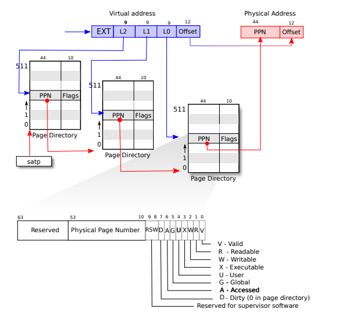

# PageTable-Lab

## 相关知识

为了进行本次Lab，需要知道操作系统页表知识以及XV6对应的源码实现

### 页表

操作系统通过页表实现每个进程拥有自己独立的地址空间，页表内存储虚拟地址到物理地址的映射关系，页表允许进程拥有自己独立地址空间且复用同一块物理内存。

#### 硬件相关

RISC-V指令（用户和内核都是）操作虚拟地址，而物理内存是通过物理地址来访问的，通过将虚拟地址转换成物理地址来结合两种地址。

xv6是64位系统，但是虚拟地址只使用低`39`位，高`25`位不使用，在这种配置下，RISC-V页表可以看作是一个数组，共有`2^27`个页表条目`PTE`，而每个`PTE`包含了`44`位的物理页号`PPN`和一些标志位，内存管理单元`MMU`通过`39`位虚拟地址的高`27`位来索引一个`PTE`，取出物理页号`PPN`和虚拟地址的低`12`位页偏移`VPO`组合成一个`56`位的物理地址

|标记|含义|
|:-:|:-:|
|VA|虚拟地址，39位|
|VPN|虚拟页号，27位|
|VPO|页偏移量，12位|

|标记|含义|
|:-:|:-:|
|PA|物理地址，56位|
|PPN|物理页号，44位|
|PP0|页偏移量，12位，等于VPO|

按理来说`64`位机应该有`2^64`次方个虚拟地址，那么页表就应该有对应数量的`PTE`，而页表本身也是存放在物理内存中，存放这么大的页表显然是不现实的，所以做了两个优化:
1. 并不是对每个虚拟地址都做对应的映射关系，而是对一个页（4096字节）做映射，12位`VPO`可以访问页内的每一个字节
2. 但是这样还是每个进程页表会有`2^27`个`PTE`，所以用多级页表机制来解决占用物理内存过多问题，此时页表是一个树形结构，具体就是将27位`VPN`拆分成3个字段`L2`,`L1`和`L0`，每个`9`位，作为每一级页表的索引，这样每级页表就有`512`个`PTE`，真正解决占用内存过高的关键在于对于那些没有做物理内存映射的虚拟地址，可以不对它做下一级页表的构造



|PTE标志位|含义|
|:-:|:-:|
|V|当前PTE有效|
|R|物理页面可读|
|W|物理页面可写|
|X|物理页面可执行|
|U|用户进程可访问|
|G|Unknown|
|A|访问过|
|D|修改过|

每个CPU都有一个寄存器`satp`，存储当前进程根页表的物理地址，用`L2`作为索引根页表得到`44`位`PPN`，然后补上`12`个零得到第二级页表的页表基址（每个页表是`512`个`PTE`，每个`PTE`是`8`字节，所以页表大小为512 * 8 = 4096字节，占一个页），然后又用`L1`作为索引用同样方法得到第三级页表的页表基址，最后用`L0`作为索引得到真正的物理页号`PPN`，加上`12`位页偏移量`VPO`得到真正的物理地址

多级页表相对于单级页表减少了页表物理内存的占用，但是由于翻译一个虚拟地址要访问三次物理内存，同样地也增加了时间，解决方法是使用处理器内部`TLB`缓存`PTE`条目。操作系统并不知道`TLB`是怎么操作的，只是当操作系统切换页表时要告诉处理器`TLB`要刷新。

#### 内核地址空间

Xv6位每个进程维护了一个页表，描述每个进程的地址空间，另外还有一个单独的内核页表描述内核地址空间。


内核起始地址为`0x80000000`，底下是IO设备相关，内核页表做的是恒等映射，即虚拟地址和对应物理地址相等，但是有两个例外：
1. `trampoline page`，它在虚拟地址空间的最上方，用户页表也有同样的映射。对应的物理页面如图所示被映射了两次，一次是虚拟地址顶端，一次是恒等映射。
2. 内核栈，每个进程拥有一个用户栈和一个内核栈，每个内核栈下方都有一个没有做映射的`guard page`，如果内核发生栈溢出访问到了`guard page`，那么就会产生一个缺页异常

内核地址空间只有`Trampoline`和`kernel text`权限是`R-X`的，其它映射页面权限是`RW-`

#### 进程地址空间

每个进程拥有自己独立的页表，当Xv6切换进程时，也要切换进程的页表。进程的地址空间从0开始，可以增长到`MAXVA`，可以寻址256G的虚拟内存。

每个进程页表可以将相同的虚拟地址映射到不同的物理地址，所以每个进程拥有自己独立的地址空间。进程的虚拟地址空间是连续的，但可能映射到不连续的物理内存。


同内核栈一样，用户栈下方也有一个未建立映射的`guard page`防止溢出

### XV6源码

#### kernel/memlayout.h

定义了和xv6内存布局相关的宏定义及宏函数，本次Lab不涉及IO设备，下面仅列出部分定义

|   宏定义   |                  含义                   |
| :--------: | :-------------------------------------: |
|  KERNBASE  |            DRAM起始物理地址             |
|  PHYSTOP   |            DRAM结束物理地址             |
| TRAMPOLINE | trampoline page虚拟地址，暂时不知道作用 |
| KSTACK(p)  |      计算进程对应内核栈的虚拟地址       |

```c
// DRAM大小125M
#define KERNBASE 0x80000000L
#define PHYSTOP (KERNBASE + 128*1024*1024)

#define TRAMPOLINE (MAXVA - PGSIZE)

// 每个内核栈下方跟着一个保护页(未分配物理内存)
#define KSTACK(p) (TRAMPOLINE - ((p)+1)* 2*PGSIZE)
```

#### kernel/rscv.h

定义了一大堆内联函数，里面包含语句`asm volatile("")`内嵌汇编，暂时不知道作用，下面仅列出和页表相关代码

|     宏定义     |                     含义                     |
| :------------: | :------------------------------------------: |
|     PGSIZE     |                    页大小                    |
|    PGSHIFT     |               页偏移量占用位数               |
| PGROUNDUP(sz)  |               地址对齐（向上）               |
| PGROUNDDOWN(a) |               地址对齐（向下）               |
|     PTE_V      |               置位表明PTE有效                |
|     PTE_R      |              置位表明对应页可读              |
|     PTE_W      |              置位表明对应页可写              |
|     PTE_X      |             置位表明对应页可执行             |
|     PTE_U      |         置位表明对应页用户程序可访问         |
|   PA2PTE(pa)   |                物理地址->PTE                 |
|  PTE2PA(pte)   |                PTE->物理地址                 |
| PTE_FLAGS(pte) |               PTE的10个标志位                |
|     PXMASK     |             每级页表索引占用位数             |
| PXSHIFT(level) | 对某级页表来说，VA应当右移多少位得到对应索引 |
| PX(level, va)  |          从虚拟地址取出某级页表索引          |
|     MAXVA      |                虚拟地址最大值                |

```c
// 页面大小为4096字节，对应12位偏移量
#define PGSIZE 4096
#define PGSHIFT 12

#define PGROUNDUP(sz)  (((sz)+PGSIZE-1) & ~(PGSIZE-1))
#define PGROUNDDOWN(a) (((a)) & ~(PGSIZE-1))

#define PTE_V (1L << 0)
#define PTE_R (1L << 1)
#define PTE_W (1L << 2)
#define PTE_X (1L << 3)
#define PTE_U (1L << 4)

// 右移12去除偏移量，左移10位留出标志位
#define PA2PTE(pa) ((((uint64)pa) >> 12) << 10)

#define PTE2PA(pte) (((pte) >> 10) << 12)

// pte低10位表示标志位
#define PTE_FLAGS(pte) ((pte) & 0x3FF)

// 三级页表，每级用9bit作为索引
#define PXMASK          0x1FF
// level是从2到0的，2对应根页表，0里的pte存储真正的物理页面地址
#define PXSHIFT(level)  (PGSHIFT+(9*(level)))
#define PX(level, va) ((((uint64) (va)) >> PXSHIFT(level)) & PXMASK)

// 虚拟地址是39位，但是最高1位不用
#define MAXVA (1L << (9 + 9 + 9 + 12 - 1))

typedef uint64 pte_t;
typedef uint64 *pagetable_t;
```

#### kernel/vm.c

定义内核/用户虚拟内存相关函数，`uvm`开头代表用户虚拟内存函数，`kvm`开头代表内核虚拟内存函数

|    接口     | 作用  |
| :---------: | :---: |
|   kvminit   |创建内核页表（直接映射）|
| kvminithart |将内核页表物理地址写入`satp`寄存器，并作废`TLB`       |
|    walk     |给定根页表和虚拟地址，返回三级页表的对应的`PTE`物理地址或者0  |
|  walkaddr   |给定根页表和虚拟地址，返回对应物理地址或者0，只能用于查找用户页 |
|   kvmmap    |给定虚拟地址、物理地址、要映射的大小及权限，内核页表新增映射关系|
|    kvmpa    |翻译内核虚拟地址成物理地址|
|  mappages   |给定根页表、虚拟地址、物理地址、映射大小和权限，更新页表，`kvmmap`调用该函数且传入页表参数为内核页表，该函数也可以为用户程序所用|
|  uvmunmap   |移除虚拟地址`va`开始的`npages`个页面的映射关系，可选释放物理页|
|  uvmcreate  |创建一个空的用户页表|
|   uvminit   |仅作用于第一个用户进程，将`initcode`拷贝到用户虚拟地址0开始的地方|
|  uvmalloc   |为用户程序分配物理内存|
| uvmdealloc  |为用户程序释放物理内存|
|  freewalk   |释放页表占用内存|
|   uvmfree   |释放用户程序物理内存和页表物理内存|
|   uvmcopy   |子进程完全拷贝父进程地址空间，并更新子进程页表|
|  uvmclear   |让用户程序某虚拟页不能被用户程序访问|
|   copyout   |给定用户页表和用户虚拟地址，将内核数据拷贝到对应虚拟地址处|
|   copyin    |给定用户页表和用户虚拟地址，将用户虚拟地址处数据拷贝到内核中|
|  copyinstr  |`copyin的拷贝字符串版本|

#### kernel/kalloc.c

物理页面分配相关函数

|接口|作用|
|:-:|:-:|
|kinit|一开始是没有内存可用的，初始化释放差不多所有物理内存|
|freerange|释放指定物理地址区间内的内存|
|kfree|释放物理页|
|kalloc|分配物理页|

## _Print a page table (<font color=00ff00><u>easy.</u></font>)_

定义一个函数`void vmprint(pagetable_t pgtbl)`打印出`pgtbl`这个页表的条目信息，如下所示

```
page table 0x0000000087f6e000
..0: pte 0x0000000021fda801 pa 0x0000000087f6a000
.. ..0: pte 0x0000000021fda401 pa 0x0000000087f69000
.. .. ..0: pte 0x0000000021fdac1f pa 0x0000000087f6b000
.. .. ..1: pte 0x0000000021fda00f pa 0x0000000087f68000
.. .. ..2: pte 0x0000000021fd9c1f pa 0x0000000087f67000
..255: pte 0x0000000021fdb401 pa 0x0000000087f6d000
.. ..511: pte 0x0000000021fdb001 pa 0x0000000087f6c000
.. .. ..510: pte 0x0000000021fdd807 pa 0x0000000087f76000
.. .. ..511: pte 0x0000000020001c0b pa 0x0000000080007000
```

其中`..`的个数表示当前页表级别，`pte`对应页表条目信息，`pa`是从`pte`中提取出来的物理地址。注意不要打印那些没有映射的页表条目

页表用`mappages`来建立映射,其中调用了`walk`来查询对应的第三级页表`PTE`

```C
int
mappages(pagetable_t pagetable, uint64 va, uint64 size, uint64 pa, int perm)
{
  uint64 a, last;
  pte_t *pte;

  a = PGROUNDDOWN(va);
  last = PGROUNDDOWN(va + size - 1);
  for(;;){
    // 建立建立一二级页表的映射，并返回第三级页表对应的PTE，设置了alloc=1，未分配下一级页表则分配物理页并映射
    if((pte = walk(pagetable, a, 1)) == 0)
      return -1;
    if(*pte & PTE_V)
      panic("remap");
    // 第三级页表PTE设置
    *pte = PA2PTE(pa) | perm | PTE_V;
    if(a == last)
      break;
    a += PGSIZE;
    pa += PGSIZE;
  }
  return 0;
}

pte_t *
walk(pagetable_t pagetable, uint64 va, int alloc)
{
  if(va >= MAXVA)
    panic("walk");

  for(int level = 2; level > 0; level--) {
    // 当前页表PTE条目
    pte_t *pte = &pagetable[PX(level, va)];
    if(*pte & PTE_V) {
      pagetable = (pagetable_t)PTE2PA(*pte);
    } else {
        // 如果当前页表PTE非有效且设置了alloc，则会为下一级页表分配物理页，更改当前页表PTE
      if(!alloc || (pagetable = (pde_t*)kalloc()) == 0)
        return 0;
        // 清零整个页表
      memset(pagetable, 0, PGSIZE);
        // 可以看到仅仅设置了有效位，读写可执行都没设置
      *pte = PA2PTE(pagetable) | PTE_V;
    }
  }
  // 返回第三级页表PTE，如果是新建立的则被清零了尚未被设置标志位
  return &pagetable[PX(0, va)];
}
```

从上可以看出，起初一级页表是一个空页表，调用`mappages`来建立映射关系，并且前两级页表标志位只有`PTE_V`，第三级页表根据传入的`perm`参数来设置，一般都是`PTE_R | PTE_W | PTE_V`或者`PTE_R | PTE_X | PTE_V`

参考`freewalk`函数，`freewalk`用来遍历页表并且取消映射，要求第三级页表的映射全部清除，否则会造成`panic`

`freewalk`类似深度优先搜索，先将下一级页表清零并释放物理内存，再清除当前页表映射和释放物理内存

```c
void
freewalk(pagetable_t pagetable)
{
  // there are 2^9 = 512 PTEs in a page table.
  for(int i = 0; i < 512; i++){
    pte_t pte = pagetable[i];
    if((pte & PTE_V) && (pte & (PTE_R|PTE_W|PTE_X)) == 0){
      // 如果是前两级页表，递归清零下一级页表
      uint64 child = PTE2PA(pte);
      freewalk((pagetable_t)child);
      // 清零当前页表
      pagetable[i] = 0;
    } else if(pte & PTE_V){
        // 第三级页表没有被清除则标志为PTE_R | PTE_W | PTE_V，满足这个条件，会造成panic
      panic("freewalk: leaf");
    }
  }

    // 释放页表占用的物理内存
  kfree((void*)pagetable);
}
```

仿照`freewalk`可以写出下面的`vmprint`实现

```c
void vmprint(pagetable_t pgtbl) {
    for(int i = 0; i < 512; i++) {
        pte_t pte = pgtbl[i];
        // 非有效跳过
        if((pte & PTE_V) == 0)
            continue;
        printf("PTE信息\n");
        uint64 child = PTE2PA(pte);
        // 有效且未设置读写可执行位->是第一二级页表->递归
        if((pte & (PTE_R | PTE_W | PTE_X)) == 0)
            vmprint((pagetable_t)child);
    }
}
```

但是打印信息和页表级数相关，且接口已经规定只有一个页表参数，只能另外实现一个函数`printwalk`打印，然后用`vmprint`调用该函数，代码如下：

```c
void printwalk(pagetable_t pgtbl, int depth) {
    char *s;
    if(depth == 0)
        s = "..";
    else if(depth == 1)
        s = ".. ..";
    else
        s= ".. .. ..";
    for(int i = 0; i < 512; ++i) {
        pte_t pte = pgtbl[i];
        if((pte & PTE_V) == 0)
            continue;
        uint64 child = PTE2PA(pte);
        printf("%s%d: pte %p pa %p\n", s, i, pte, child);
        if((pte & (PTE_R | PTE_W | PTE_X)) == 0)
            printwalk((pagetable_t)child, depth + 1);
    }
}

void vmprint(pagetable_t pgtbl) {
    printf("page table %p\n", pgtbl);
    printwalk(pgtbl, 0);
}
```

在`kernel/defs.h`添加`vmprint`的接口声明

根据实验要求，在`kernel/exec.c`的`exec`中打印第一个进程的页表信息

```c
int
exec(char *path, char **argv) {
    // ...
    struct proc *p = myproc();
    // ...
    if(p->pid == 1) {
        vmprint(p->pagetable);
    }
    // ...
}
```

### 思考题

Explain the output of vmprint in terms of Fig 3-4 from the text. What does page 0 contain? What is in page 2? When running in user mode, could the process read/write the memory mapped by page 1?

就是看第一个进程页表的打印信息，回答虚拟地址第0页和第2页里包含什么，进程在用户态下能够读写第1页吗?

首先看一下内核的`main`函数，在`kernel/main.c`中

```c
void main() {
  if(cpuid() == 0) {
    // ...
    userinit(); // 初始化第一个用户进程
    // ...
  } else {
    // ...
  }
  scheduler();  // 进程调度
}
```

`userinit`在`kernel/proc.c`中，和第一个用户进程相关，主要就是调用`uvminit`将存方二进制代码的`initcode`数组拷贝到一个用`kalloc`新分配的物理页中，并将第一个进程虚拟地址空间的第0页映射到这个物理页中，完成后进程`sz`为一个页，并且置进程状态为`RUNNABLE`

```c
// a user program that calls exec("/init")
// od -t xC initcode
uchar initcode[] = {
  0x17, 0x05, 0x00, 0x00, 0x13, 0x05, 0x45, 0x02,
  0x97, 0x05, 0x00, 0x00, 0x93, 0x85, 0x35, 0x02,
  0x93, 0x08, 0x70, 0x00, 0x73, 0x00, 0x00, 0x00,
  0x93, 0x08, 0x20, 0x00, 0x73, 0x00, 0x00, 0x00,
  0xef, 0xf0, 0x9f, 0xff, 0x2f, 0x69, 0x6e, 0x69,
  0x74, 0x00, 0x00, 0x24, 0x00, 0x00, 0x00, 0x00,
  0x00, 0x00, 0x00, 0x00
};

// Load the user initcode into address 0 of pagetable,
// for the very first process.
// sz must be less than a page.
void
uvminit(pagetable_t pagetable, uchar *src, uint sz)
{
  char *mem;

  if(sz >= PGSIZE)
    panic("inituvm: more than a page");
  mem = kalloc();
  memset(mem, 0, PGSIZE);
  mappages(pagetable, 0, PGSIZE, (uint64)mem, PTE_W|PTE_R|PTE_X|PTE_U);
  memmove(mem, src, sz);
}

void
userinit(void)
{
  struct proc *p;

  p = allocproc();
  initproc = p;
  
  // allocate one user page and copy init's instructions
  // and data into it.
  uvminit(p->pagetable, initcode, sizeof(initcode));
  p->sz = PGSIZE;

  // prepare for the very first "return" from kernel to user.
  p->trapframe->epc = 0;      // user program counter
  p->trapframe->sp = PGSIZE;  // user stack pointer

  safestrcpy(p->name, "initcode", sizeof(p->name));
  p->cwd = namei("/");

  p->state = RUNNABLE;

  release(&p->lock);
}
```

`initcode`数组中的十六进制信息可以在`user/initcode.S`中可以看到，可以看到主要就是调用`exec(init, argv)`

```
# Initial process that execs /init.
# This code runs in user space.

#include "syscall.h"

# exec(init, argv)
.globl start
start:
        la a0, init
        la a1, argv
        li a7, SYS_exec
        ecall

# for(;;) exit();
exit:
        li a7, SYS_exit
        ecall
        jal exit

# char init[] = "/init\0";
init:
  .string "/init\0"

# char *argv[] = { init, 0 };
.p2align 2
argv:
  .long init
  .long 0
```

完成了`userinit`后，就开始用`scheduler`来调度程序了，主要就是从进程列表中取出一个`RUNNABLE`状态的进程执行，当且进程只有一个那就是刚刚置为`RUNNABLE`状态的第一个进程`initcode`，作用如上所示就是执行`exec(init, argv)`，程序会跳转到`exec`处

```c
void scheduler(void)
{
  struct proc *p;
  struct cpu *c = mycpu();
  
  c->proc = 0;
  for(;;){
    // Avoid deadlock by ensuring that devices can interrupt.
    intr_on();
    
    int found = 0;
    for(p = proc; p < &proc[NPROC]; p++) {
      acquire(&p->lock);
      if(p->state == RUNNABLE) {
        // Switch to chosen process.  It is the process's job
        // to release its lock and then reacquire it
        // before jumping back to us.
        p->state = RUNNING;
        c->proc = p;
        swtch(&c->context, &p->context);

        // Process is done running for now.
        // It should have changed its p->state before coming back.
        c->proc = 0;

        found = 1;
      }
      release(&p->lock);
    }
#if !defined (LAB_FS)
    if(found == 0) {
      intr_on();
      asm volatile("wfi");
    }
#else
    ;
#endif
  }
}
```

再看一下`kernel/exec.c`中的`exec`函数，它主要就是替换当前执行`exec`进程的地址空间，从指定路径读取可执行文件（`elf`文件）然后分配物理页存放可执行文件中的程序段并建立映射关系，另外还分配了两个页用来作为用户栈

Xv6应用程序使用`ELF`格式，一个`ELF`二进制文件包含一个`ELF header`然后是一系列的`program section header`，Xv6应用程序只有一个`program section header`，而其它操作系统可能有多个来分别存放数据和指令

当前`exec`读取的是`user/_init`，信息如下，其中`vaddr`为应当加载到的虚拟地址，`filesz`指出了程序头的大小，后面读取`elf`文件应该用这个大小，而不是`memsz`，`memsz`应当比`filesz`大，`uvmalloc`用这个大小来分配物理内存，多出的部分应当补0

```sh
$ objdump -p user/_init

user/_init:     file format elf64-little

Program Header:
    LOAD off    0x0000000000000078 vaddr 0x0000000000000000 paddr 0x0000000000000000 align 2**3
         filesz 0x00000000000009f8 memsz 0x0000000000000a10 flags rwx
```

如上所示，`_init`程序头的`filesz`大小为`2552`字节，而`memsz`大小为`2576`字节，应当加载到虚拟地址0开始处

```c
int exec(char *path, char **argv) {
  // ...
  uint64 sz = 0;
  struct elfhdr elf;
  struct proghdr ph;
  pagetable_t pagetable = 0;
  struct proc *p = myproc();  // 当前进程

  // ...
  // 读取elf头
  if(readi(ip, 0, (uint64)&elf, 0, sizeof(elf)) != sizeof(elf))
    goto bad;

  // ...
  // 读取程序头，elf.phnum = 1
  for(i=0, off=elf.phoff; i<elf.phnum; i++, off+=sizeof(ph)){
    if(readi(ip, 0, (uint64)&ph, off, sizeof(ph)) != sizeof(ph))
      goto bad;
    // ...
    // 分配物理内存并建立映射，用memsz
    // sz = 0, 表明第0页用来存放程序
    if((sz1 = uvmalloc(pagetable, sz, ph.vaddr + ph.memsz)) == 0)
      goto bad;
    sz = sz1;
    // ...
    // 将程序读取到物理内存你，用filesz
    if(loadseg(pagetable, ph.vaddr, ip, ph.off, ph.filesz) < 0)
      goto bad;
  }

  // ...

  // Allocate two pages at the next page boundary.
  // Use the second as the user stack.
  // 此时sz应该为memsz，向上取整到4096，即第1页开始地址
  sz = PGROUNDUP(sz);
  uint64 sz1;
  // 分配两个物理页并建立映射，查看之前的用户地址空间图可以发现，一个用来当用户栈，一个是guard page
  if((sz1 = uvmalloc(pagetable, sz, sz + 2*PGSIZE)) == 0)
    goto bad;
  sz = sz1;
  // 取消guard page的映射，这里只是置零了PTE_U标志表示用户不能访问，实际上并没有释放掉guard page的物理内存
  uvmclear(pagetable, sz-2*PGSIZE);

  // ...
}
```

可以进行调试查看相关信息，使用命令`make CPUS=1 qemu-gdb`

```sh
$ make CPUS=1 qemu-gdb
*** Now run 'gdb' in another window.
qemu-system-riscv64 -machine virt -bios none -kernel kernel/kernel -m 128M -smp 1 -nographic -drive file=fs.img,if=none,format=raw,id=x0 -device virtio-blk-device,drive=x0,bus=virtio-mmio-bus.0 -S -gdb tcp::26000
```

在另一个窗口下执行`gdb-multiarch`

```sh
GNU gdb (Ubuntu 9.2-0ubuntu1~20.04) 9.2
Copyright (C) 2020 Free Software Foundation, Inc.
License GPLv3+: GNU GPL version 3 or later <http://gnu.org/licenses/gpl.html>
This is free software: you are free to change and redistribute it.
There is NO WARRANTY, to the extent permitted by law.
Type "show copying" and "show warranty" for details.
This GDB was configured as "x86_64-linux-gnu".
Type "show configuration" for configuration details.
For bug reporting instructions, please see:
<http://www.gnu.org/software/gdb/bugs/>.
Find the GDB manual and other documentation resources online at:
    <http://www.gnu.org/software/gdb/documentation/>.

For help, type "help".
Type "apropos word" to search for commands related to "word".
The target architecture is assumed to be riscv:rv64
warning: No executable has been specified and target does not support
determining executable automatically.  Try using the "file" command.
0x0000000000001000 in ?? ()

# 在exec入口处打断点
(gdb) b exec
Breakpoint 1 at 0x80004c26: file kernel/exec.c, line 14.
# 继续执行
(gdb) c
Continuing.

Breakpoint 1, exec (path=path@entry=0x3fffffdf00 "/init", argv=argv@entry=0x3fffffde00) at kernel/exec.c:14
14      {
# 执行layout split方便调试
(gdb) layout split
Detaching from program: , process 1
Remote connection closed
# 在35行打断点
(gdb) b 35
Breakpoint 2 at 0x80004c9a: file kernel/exec.c, line 35.
# 继续执行，此时已经读完了elf头
(gdb) c
Continuing.

Breakpoint 2, exec (path=path@entry=0x3fffffdf00 "/init", argv=argv@entry=0x3fffffde00) at kernel/exec.c:35
# 查看一下相关信息，例如程序头数量
(gdb) p /d elf.phnum
$1 = 1
# 在45行打断点
(gdb) b 45
Breakpoint 3 at 0x80004f76: file kernel/exec.c, line 45.
# 继续执行，此时已经读完了唯一的程序头
(gdb) c
Continuing.

Breakpoint 3, exec (path=path@entry=0x3fffffdf00 "/init", argv=argv@entry=0x3fffffde00) at kernel/exec.c:45
# 查看一下程序头相关信息，结果和之前看到的一样
(gdb) p /d ph.vaddr
$2 = 0
(gdb) p /d ph.filesz
$3 = 2552
(gdb) p /d ph.memsz
$4 = 2576
```

### 思考题回答及后续

到这里就可以解答上面的思考题了，第0页是用来存放`user/_init`的程序，第2页是用户栈，第0页是用户栈下方的`guard page`，如上这个`guard page`标志位`PTE_U`已经被置0，在用户态下是无法对它进行读写的

也就是对应这部分
```
page table 0x0000000087f6e000
..0: pte 0x0000000021fda801 pa 0x0000000087f6a000
.. ..0: pte 0x0000000021fda401 pa 0x0000000087f69000
.. .. ..0: pte 0x0000000021fdac1f pa 0x0000000087f6b000
.. .. ..1: pte 0x0000000021fda00f pa 0x0000000087f68000
.. .. ..2: pte 0x0000000021fd9c1f pa 0x0000000087f67000
```

另外还可以发现打印信息还有几行如下，也就是虚拟地址空间的最高两页
```
..255: pte 0x0000000021fdb401 pa 0x0000000087f6d000
.. ..511: pte 0x0000000021fdb001 pa 0x0000000087f6c000
.. .. ..510: pte 0x0000000021fdd807 pa 0x0000000087f76000
.. .. ..511: pte 0x0000000020001c0b pa 0x0000000080007000
```

这个也可以在`exec`中找到答案，如下

```c
int exec(char *path, char **argv) {
  // ...
  if((pagetable = proc_pagetable(p)) == 0)
    goto bad;
  // ...
}
```

这个`proc_pagetable`函数在`kernel/proc.c`中，就是它为执行`exec`的进程创建了一个新页表，并建立了两个映射，如下用`uvmcreate`分配一个物理页作为新页表并清零，然后用`mappages`建立两个映射，一个是`trampoline`，另一个是`trapframe`，可以在`kernel/memlayout.h`中查看，这俩就是在地址空间顶端

```c
pagetable_t
proc_pagetable(struct proc *p)
{
  pagetable_t pagetable;

  // An empty page table.
  pagetable = uvmcreate();
  if(pagetable == 0)
    return 0;

  // map the trampoline code (for system call return)
  // at the highest user virtual address.
  // only the supervisor uses it, on the way
  // to/from user space, so not PTE_U.
  if(mappages(pagetable, TRAMPOLINE, PGSIZE,
              (uint64)trampoline, PTE_R | PTE_X) < 0){
    uvmfree(pagetable, 0);
    return 0;
  }

  // map the trapframe just below TRAMPOLINE, for trampoline.S.
  if(mappages(pagetable, TRAPFRAME, PGSIZE,
              (uint64)(p->trapframe), PTE_R | PTE_W) < 0){
    uvmunmap(pagetable, TRAMPOLINE, 1, 0);
    uvmfree(pagetable, 0);
    return 0;
  }

  return pagetable;
}
```

另外`initcode`进程执行`exec(init, argv)`后`init`进程的`pid`仍为1，它干的事很简单就是先`fork`一个子进程，然后子进程执行`exec(sh, argv)`来启动`shell`，`init`进程自己则无限循环调用`wait`来完成回收工作。相关代码在`user/init.c`中可以查看


## _A kernel page table per process(<font color=ff0000><u>hard.</u></font>)_

接下来两个实验目的是让内核可以直接访问用户虚拟地址，而不是要先通过用户进程页表和用户虚拟地址转换成物理地址，比如之前的`copyin`，将`srcva`开始的`len`字节拷贝到`dst`中，这里的`dst`是内核虚拟地址，但是内核是直接映射的，所以等同是物理地址。`copyin`要先将`srcva`根据传进来的用户页表`pagetable`翻译成物理地址，然后在两个物理地址间拷贝数据。

至于为什么要先通过用户页表来做一次转换，是因为内核页表不包含用户虚拟地址到对应物理页的映射关系。

之前说过，Xv6每个进程有一个单独的用户页表，然后还有一个全局的内核页表，本次实验目的是实现每个进程有一个内核页表

```c
int copyin(pagetable_t pagetable, char *dst, uint64 srcva, uint64 len)
{
  uint64 n, va0, pa0;

  while(len > 0){
    va0 = PGROUNDDOWN(srcva);
    pa0 = walkaddr(pagetable, va0);
    if(pa0 == 0)
      return -1;
    n = PGSIZE - (srcva - va0);
    if(n > len)
      n = len;
    memmove(dst, (void *)(pa0 + (srcva - va0)), n);

    len -= n;
    dst += n;
    srcva = va0 + PGSIZE;
  }
  return 0;
}
```

在`kernel/proc.h`中进程PCB结构体`proc`中添加成员`kpagetable`来记录内核页表信息

```c
struct proc {
  // ...
  pagetable_t kpagetable;
  // ...
}
```

参考`kvminit`在`kernel/vm.c`中添加函数`kvmcreate`来新建一个内核页表并初始化，内核页表映射用的`kvmmap`只对全局内核页表操作，添加函数`ukvmmap`来对指定内核页表操作，在`kernel/defs.h`中添加这两个函数的声明
   
```c
void ukvmmap(pagetable_t kpgtbl, uint64 va, uint64 pa, uint64 sz, int perm) {
  if(mappages(kpgtbl, va, sz, pa, perm) != 0)
    panic("ukvmmap");
} 
pagetable_t kvmcreate() {
  pagetable_t kpgtbl = (pagetable_t)kalloc();
  memset(kpgtbl, 0, PGSIZE);

  ukvmmap(kpgtbl,UART0, UART0, PGSIZE, PTE_R | PTE_W);
  ukvmmap(kpgtbl,VIRTIO0, VIRTIO0, PGSIZE, PTE_R | PTE_W);
  ukvmmap(kpgtbl,CLINT, CLINT, 0x10000, PTE_R | PTE_W);
  ukvmmap(kpgtbl,PLIC, PLIC, 0x400000, PTE_R | PTE_W);
  ukvmmap(kpgtbl,KERNBASE, KERNBASE, (uint64)etext-KERNBASE, PTE_R | PTE_X);
  ukvmmap(kpgtbl,(uint64)etext, (uint64)etext, PHYSTOP - (uint64)etext, PTE_R | PTE_W);
  ukvmmap(kpgtbl,TRAMPOLINE, (uint64)trampoline, PGSIZE, PTE_R | PTE_X);

  return kpgtbl;
}
```

修改`kernel/proc.c`中的`allocproc`函数，为每个进程分配一个内核页表
    
```c
static struct proc*
allocproc(void) {
  // ...
  // An empty user page table.
  p->pagetable = proc_pagetable(p);
  if(p->pagetable == 0){
    freeproc(p);
    release(&p->lock);
    return 0;
  }

  // 内核页表
  p->kpagetable = kvmcreate();
  if(p->kpagetable == 0) {
    freeproc(p);
    release(&p->lock);
    return 0;
  }
  // ...
}
```

上面的内核页表还没有进行内核栈的映射，内核栈的创建和映射是在`kernel/proc.c`中的`procinit`中进行的，将这部分功能从`procinit`中拆除，放到`allocproc`中
   
```c
void
procinit(void)
{
  struct proc *p;
  
  initlock(&pid_lock, "nextpid");
  for(p = proc; p < &proc[NPROC]; p++) {
      initlock(&p->lock, "proc");

      // Allocate a page for the process's kernel stack.
      // Map it high in memory, followed by an invalid
      // guard page.
      // char *pa = kalloc();
      // if(pa == 0)
      //   panic("kalloc");
      // uint64 va = KSTACK((int) (p - proc));
      // kvmmap(va, (uint64)pa, PGSIZE, PTE_R | PTE_W);
      // p->kstack = va;
  }
  //kvminithart();
}

static struct proc*
allocproc(void) {
  // ...
  // An empty user page table.
  p->pagetable = proc_pagetable(p);
  if(p->pagetable == 0){
    freeproc(p);
    release(&p->lock);
    return 0;
  }

  // 内核页表
  p->kpagetable = kvmcreate();
  if(p->kpagetable == 0) {
    freeproc(p);
    release(&p->lock);
    return 0;
  }

  // 为进程创建内核栈并建立映射
  char *pa = kalloc();
  if(pa == 0)
    panic("kalloc");
  uint64 va = KSTACK((int)(p - proc));
  ukvmmap(p->kpagetable, va, (uint64)pa, PGSIZE, PTE_R | PTE_W);
  p->kstack = va;
  // ...
}
```

修改`kernel/proc.c`中的调度器`scheduler`，使得调度进程前将进程的内核页表地址载入`satp`寄存器中，如果没有进程运行，那将全局内核页表地址载入`satp`，可以参考`kernel/vm.c`中的`kvminithart`

```c
void
scheduler(void)
{
  struct proc *p;
  struct cpu *c = mycpu();
  
  c->proc = 0;
  for(;;){
    // Avoid deadlock by ensuring that devices can interrupt.
    intr_on();
    
    int found = 0;
    for(p = proc; p < &proc[NPROC]; p++) {
      acquire(&p->lock);
      if(p->state == RUNNABLE) {
        // Switch to chosen process.  It is the process's job
        // to release its lock and then reacquire it
        // before jumping back to us.
        p->state = RUNNING;
        c->proc = p;

        // 在上下文切换前，将这个进程的内核页表放入satp寄存器
        w_satp(MAKE_SATP(p->kpagetable));
        sfence_vma();

        swtch(&c->context, &p->context);

        // Process is done running for now.
        // It should have changed its p->state before coming back.
        c->proc = 0;
        
        // 上面说到这里程序就跑完了，也就是没有程序在运行要切换成全局内核页表
        kvminithart();

        found = 1;
      }
      release(&p->lock);
    }
#if !defined (LAB_FS)
    if(found == 0) {
      intr_on();
      asm volatile("wfi");
    }
#else
    ;
#endif
  }
}
```

需要在`kernel/proc.c`中的`freeproc`中将内核页表释放掉，参考释放用户页表的`proc_freepagetable`，另写一个`proc_freekpagetable`来释放内核页表，先将之前那些在`kvmcreate`中创建的映射用`kvmunmap`取消掉，但是不释放物理内存，然后调用`kvmfree`释放内核栈占用物理内存及页表占用的物理内存，在`kernel/defs.h`中添加相关函数的声明

```c
// 对uvmunmap的封装，保持名称一致
void kvmunmap(pagetable_t kpagetable, uint64 va, uint64 npages, int do_free) {
  uvmunmap(kpagetable, va, npages, do_free);
}

// 释放内核栈和页表占用物理内存
void kvmfree(pagetable_t kpagetable, uint64 kstack) {
  kvmunmap(kpagetable, kstack, 1, 1);
  freewalk(kpagetable);
}

// 给freeproc调用的接口，先取消调这些映射，否则freewalk会panic，调用kvmfree释放内核栈和页表物理内存
void proc_freekpagetable(struct proc *p) {
  kvmunmap(p->kpagetable, UART0, 1, 0);
  kvmunmap(p->kpagetable, VIRTIO0, 1, 0);
  kvmunmap(p->kpagetable, CLINT, 0x10000 / PGSIZE, 0);
  kvmunmap(p->kpagetable, PLIC, 0x400000 / PGSIZE, 0);
  kvmunmap(p->kpagetable, KERNBASE, (PHYSTOP - KERNBASE) / PGSIZE, 0);
  kvmunmap(p->kpagetable, TRAMPOLINE, 1, 0);
  // 解除用户地址空间映射，因为之前已释放用户地址空间内存，所以do_free为0
  kvmunmap(p->kpagetable, 0, PGROUNDUP(p->sz) / PGSIZE, 0);
  // 释放内核栈和页表占用物理内存
  kvmfree(p->kpagetable, p->kstack);
}

static void
freeproc(struct proc *p)
{
  if(p->trapframe)
    kfree((void*)p->trapframe);
  p->trapframe = 0;
  if(p->pagetable)
    proc_freepagetable(p->pagetable, p->sz);
  if(p->kpagetable)
    proc_freekpagetable(p);
  p->pagetable = 0;
  p->kpagetable = 0;
  p->sz = 0;
  p->pid = 0;
  p->parent = 0;
  p->name[0] = 0;
  p->chan = 0;
  p->killed = 0;
  p->xstate = 0;
  p->state = UNUSED;
}
```
  

此时如果`make qemu`的话会`panic kvmpa`，查看`kvmpa`代码发现它只用全局内核页表来将虚拟地址转换成物理地址，修改接口增加一个页表参数，另外在`kernel/virtio_disck.c`中调用了该函数，需要修改，赋予其当前进程的内核页表`myproc()->kpagetable`，在`kernel/defs.h`中更新声明

```c
uint64
kvmpa(pagetable_t kpagetable, uint64 va)
{
  uint64 off = va % PGSIZE;
  pte_t *pte;
  uint64 pa;
  
  pte = walk(kpagetable, va, 0);
  if(pte == 0)
    panic("kvmpa");
  if((*pte & PTE_V) == 0)
    panic("kvmpa");
  pa = PTE2PA(*pte);
  return pa+off;
}
```

修改完后，内核成功启动，执行`usertests`，测试用例全部通过

但是`make grade`一直会报错`test bigdir: qemu-system-riscv64: terminating on signal 15 from pid 645353 (make)`

上面是在服务器上测试的结果，在自己电脑上测试是可以通过的，`usertests`花了114.9s，猜测可能是超时导致，将`grade-lab-pgtbl`的`usertests`超时时间由300s提高为500s，最终可以通过，花时395.6s

## _Simplify copyin/copyinstr(<font color=ff0000><u>hard.</u></font>)_

上个实验为每个用户进程创建了一个内核页表，并建立了相关映射。但是，关键的用户地址空间还是没有映射到每个进程的内核页表中，这也就造成了还是无法解引用用户虚拟地址，本实验目的在于解决这个问题。

Xv6的用户进程虚拟地址从0开始，而内核虚拟地址开始于一个高地址，要求用户进程大小`p->sz`小于内核最低的虚拟地址，根据实验指导书，要求`p->sz`不超过`PLIC`

修改`kernel/vm.c`中的`copyin`和`copyinstr`使其可以直接访问用户虚拟地址不需要借助用户页表，即直接调用`kernel/vmcopyin.c`中的`copyin_new`和`copyinstr_new`，首先在`kernel/defs.h`中声明这两个函数

```c
int copyin(pagetable_t pagetable, char *dst, uint64 srcva, uint64 len)
{
  return copyin_new(pagetable, dst, srcva, len);
}

int copyinstr(pagetable_t pagetable, char *dst, uint64 srcva, uint64 max)
{
  return copyinstr_new(pagetable, dst, srcva, max);
}
```

在`kernel/vm.c`中实现`upagecopy`，作用为建立进程内核页表中用户地址空间的映射，使得内核可以直接访问用户虚拟地址，在`kernel/defs.h`中添加声明

```c
// 在kpage中建立upage从srcva开始len长度对应的物理内存的映射 
int upagecopy(pagetable_t upage, pagetable_t kpage, uint64 srcva, uint64 len) {
  pte_t *kpte, *upte;
  // 假定srcva所处的页已经映射完了，从下一页开始
  uint64 va = PGROUNDUP(srcva);
  for(; va < srcva + len; va += PGSIZE) {
    upte = walk(upage, va, 0);
    kpte = walk(kpage, va, 1);
    if(upte == 0 || kpte == 0)
      return -1;
    // 置零PTE_U位，否则内核无法访问
    *kpte = (*upte) & (~PTE_U);
  }
  return 0;
}
```

当`fork`一个子进程时，子进程需要拷贝父进程地址空间，之前`fork`已经做了用户页表的复制，但是子进程的内核页表处于初始状态，没有做子进程用户地址空间的映射，需要做如下修改：

```c
int fork(void)
{
  int i, pid;
  struct proc *np;
  struct proc *p = myproc();

  // Allocate process.
  if((np = allocproc()) == 0){
    return -1;
  }

  // Copy user memory from parent to child.
  if(uvmcopy(p->pagetable, np->pagetable, p->sz) < 0){
    freeproc(np);
    release(&np->lock);
    return -1;
  }
  np->sz = p->sz; 

  // 上方已完成父进程虚拟地址空间和页表的复制，现将子进程内核页表添加子进程用户地址空间的映射关系
  if(upagecopy(np->pagetable, np->kpagetable, 0, np->sz) < 0) {
    freeproc(np);
    release(&np->lock);
    return -1;
  }

  np->parent = p;

  // copy saved user registers.
  *(np->trapframe) = *(p->trapframe);

  // Cause fork to return 0 in the child.
  np->trapframe->a0 = 0;

  // increment reference counts on open file descriptors.
  for(i = 0; i < NOFILE; i++)
    if(p->ofile[i])
      np->ofile[i] = filedup(p->ofile[i]);
  np->cwd = idup(p->cwd);

  safestrcpy(np->name, p->name, sizeof(p->name));

  pid = np->pid;

  np->state = RUNNABLE;

  release(&np->lock);

  return pid;
}
```

`exec`对进程重新建立了用户地址空间，但是它的内核页表没有相应变化，做如下修改

```c
int exec(char *path, char **argv) {
  // ...

  // 取消掉内核页表之前的用户地址空间映射关系
  // 注意proc_freepagetable已经将用户的物理内存释放掉了，此处传入do_free参数0
  kvmunmap(p->kpagetable, 0, PGROUNDUP(oldsz) / PGSIZE, 0);
  // 对内核页表进行新用户地址空间的映射
  upagecopy(p->pagetable, p->kpagetable, 0, p->sz);

  // ...
}
```

`sbrk`会改变用户占用空间大小，也要对内核页表进行修改，`sbrk`对应内核事先是`sys_sbrk`，里面调用的是`kernel/proc.c`里的`growproc`，做相应修改

```c
int growproc(int n)
{
  uint sz, oldsz;
  struct proc *p = myproc();

  oldsz = sz = p->sz;
  if(n > 0){
    if((sz = uvmalloc(p->pagetable, sz, sz + n)) == 0) {
      return -1;
    }
    // 对新分配内存建立映射关系
    if(upagecopy(p->pagetable, p->kpagetable, oldsz, sz - oldsz) < 0) {
      return -1;
    }
  } else if(n < 0){
    sz = uvmdealloc(p->pagetable, sz, sz + n);
    // uvmdealloc已经完成了对应物理内存的释放，传入do_free为0
    kvmunmap(p->kpagetable, PGROUNDUP(sz), (PGROUNDUP(oldsz) - PGROUNDUP(sz)) / PGSIZE, 0);
  }
  p->sz = sz;
  return 0;
}
```

`userinit`是调用`uvminit`来分配一个页存储`initcode`的指令，也要对内核页表建立相应的映射

```c
void userinit(void)
{
  struct proc *p;

  p = allocproc();
  initproc = p;
  
  // allocate one user page and copy init's instructions
  // and data into it.
  uvminit(p->pagetable, initcode, sizeof(initcode));
  p->sz = PGSIZE;

  // 对刚分配的一页做内核映射
  upagecopy(p->pagetable, p->kpagetable, 0, p->sz);

  // prepare for the very first "return" from kernel to user.
  p->trapframe->epc = 0;      // user program counter
  p->trapframe->sp = PGSIZE;  // user stack pointer

  safestrcpy(p->name, "initcode", sizeof(p->name));
  p->cwd = namei("/");

  p->state = RUNNABLE;

  release(&p->lock);
}
```

还要求用户空间大小不能超过`PLIC`，在`growproc`中做相应修改

```c
int growproc(int n)
{
  uint sz, oldsz;
  struct proc *p = myproc();

  oldsz = sz = p->sz;
  if(n > 0){
    // 只有增加内存才会超过PLIC
    if(oldsz + n > PLIC)
      return -1;
    if((sz = uvmalloc(p->pagetable, sz, sz + n)) == 0) {
      return -1;
    }
    // 对新分配内存建立映射关系
    if(upagecopy(p->pagetable, p->kpagetable, oldsz, sz - oldsz) < 0) {
      return -1;
    }
  } else if(n < 0){
    sz = uvmdealloc(p->pagetable, sz, sz + n);
    // uvmdealloc已经完成了对应物理内存的释放，传入do_free为0
    kvmunmap(p->kpagetable, PGROUNDUP(sz), (PGROUNDUP(oldsz) - PGROUNDUP(sz)) / PGSIZE, 0);
  }
  p->sz = sz;
  return 0;
}
```

还可能是由于`exec`导致用户空间超过`PLIC`，在`exec`中做相应修改

```c
int exec(char *path, char **argv) {
  // ...
  if(sz > PLIC)
    goto bad;
  // ...
} 
```

编译后执行`usertests`的话会出现`panic: uvmunmap: not mapped`，gdb调试时调用栈信息如下：

```
(gdb) bt
#0  panic (s=s@entry=0x80008120 "uvmunmap: not mapped") at kernel/printf.c:126
#1  0x000000008000145e in uvmunmap (pagetable=0x87ebd000, va=va@entry=0, npages=<optimized out>,
    do_free=<optimized out>) at kernel/vm.c:210
#2  0x00000000800014bc in kvmunmap (kpagetable=<optimized out>, va=va@entry=0, npages=<optimized out>,
    do_free=do_free@entry=0) at kernel/vm.c:192
#3  0x0000000080001d00 in proc_freekpagetable (p=p@entry=0x800121b8 <proc+1104>) at kernel/proc.c:214
#4  0x0000000080001da0 in freeproc (p=p@entry=0x800121b8 <proc+1104>) at kernel/proc.c:161
#5  0x000000008000261e in wait (addr=0) at kernel/proc.c:476
#6  0x0000000080002f4c in sys_wait () at kernel/sysproc.c:38
#7  0x0000000080002e8e in syscall () at kernel/syscall.c:140
#8  0x0000000080002b78 in usertrap () at kernel/trap.c:67
#9  0x0000000000004e28 in ?? ()
```

说明`kernel/proc.c`中的`proc_freekpagetable`出现问题，具体在第214行的`kvmunmap(p->kpagetable, 0, PGROUNDUP(p->sz) / PGSIZE, 0);`，这一步作用为取消内核页表的用户地址空间映射

进入栈帧1内调试，可以看到问题出现在虚拟地址`0x2000000`上，而这个地址正好是`CLINT`的地址

```
(gdb) frame 1
#1  0x000000008000145e in uvmunmap (pagetable=0x87ebd000, va=va@entry=0, npages=<optimized out>,
    do_free=<optimized out>) at kernel/vm.c:210
210           panic("uvmunmap: not mapped");
(gdb) p /x a
$1 = 0x2000000
```

问题出现在`proc_freekpagetable`中，对地址`0x2000000`进行了两次取消映射，一次是`CLINT`，一次是取消内核页表的用户地址空间映射，实验要求用户虚拟地址低于`PLIC`，但是`CLINT`也低于这个地址，之前`upagecopy`在内核页表建立用户地址空间映射其实重映射了

```c
void proc_freekpagetable(struct proc *p) {
  kvmunmap(p->kpagetable, UART0, 1, 0);
  kvmunmap(p->kpagetable, VIRTIO0, 1, 0);
  kvmunmap(p->kpagetable, CLINT, 0x10000 / PGSIZE, 0);
  kvmunmap(p->kpagetable, PLIC, 0x400000 / PGSIZE, 0);
  kvmunmap(p->kpagetable, KERNBASE, (PHYSTOP - KERNBASE) / PGSIZE, 0);
  kvmunmap(p->kpagetable, TRAMPOLINE, 1, 0);
  // 解除用户地址空间映射，因为之前已释放用户地址空间内存，所以do_free为0
  kvmunmap(p->kpagetable, 0, PGROUNDUP(p->sz) / PGSIZE, 0);
  // 释放内核栈和页表占用物理内存
  kvmfree(p->kpagetable, p->kstack);
}
```

但是用户地址空间是连续的，它很有可能会使用`CLINT`这个地址，现在的解决方法是对进程的内核页表不做`CLINT`的映射，相应的在取消映射的地方也要修改，如下：

```c
pagetable_t kvmcreate() {
  pagetable_t kpgtbl = (pagetable_t)kalloc();
  memset(kpgtbl, 0, PGSIZE);

  ukvmmap(kpgtbl, UART0, UART0, PGSIZE, PTE_R | PTE_W);
  ukvmmap(kpgtbl, VIRTIO0, VIRTIO0, PGSIZE, PTE_R | PTE_W);
  // 注释掉，防止重映射
  // ukvmmap(kpgtbl, CLINT, CLINT, 0x10000, PTE_R | PTE_W);
  ukvmmap(kpgtbl, PLIC, PLIC, 0x400000, PTE_R | PTE_W);
  ukvmmap(kpgtbl, KERNBASE, KERNBASE, (uint64)etext-KERNBASE, PTE_R | PTE_X);
  ukvmmap(kpgtbl, (uint64)etext, (uint64)etext, PHYSTOP - (uint64)etext, PTE_R | PTE_W);
  ukvmmap(kpgtbl, TRAMPOLINE, (uint64)trampoline, PGSIZE, PTE_R | PTE_X);

  return kpgtbl;
}

void proc_freekpagetable(struct proc *p) {
  kvmunmap(p->kpagetable, UART0, 1, 0);
  kvmunmap(p->kpagetable, VIRTIO0, 1, 0);
  // kvmunmap(p->kpagetable, CLINT, 0x10000 / PGSIZE, 0);
  kvmunmap(p->kpagetable, PLIC, 0x400000 / PGSIZE, 0);
  kvmunmap(p->kpagetable, KERNBASE, (PHYSTOP - KERNBASE) / PGSIZE, 0);
  kvmunmap(p->kpagetable, TRAMPOLINE, 1, 0);
  kvmunmap(p->kpagetable, 0, PGROUNDUP(p->sz) / PGSIZE, 0);
  kvmfree(p->kpagetable, p->kstack);
}
```

编译后执行`usertests`，通过全部测试用例

执行`make grade`，通过全部测试用例

### 思考题

Explain why the third test srcva + len < srcva is necessary in copyin_new(): give values for srcva and len for which the first two test fail (i.e., they will not cause to return -1) but for which the third one is true (resulting in returning -1).

### 思考题解答

下面这句代码前两个条件很好理解，限制了要拷贝的数据完全处于用户可访问的空间内，关键在于第三个条件`srcva + len < srcva`

```c
  if (srcva >= p->sz || srcva+len >= p->sz || srcva+len < srcva)
    return -1;
```

`srcva`和`len`类型均为`uint64`，相加比之前还小只有一种情况那就是算数溢出，比如说进程占用内存`p->sz = 0x3000000`，然后`srcva = 0x2000000`，`len = 0xFFFFFFFFFF000000`，这样`srcva + len = 0x1000000`，不满足前两个条件，如果没有第三个条件，那么就会顺利通过判断然后执行复制，然后访问到用户没有映射到的区域


