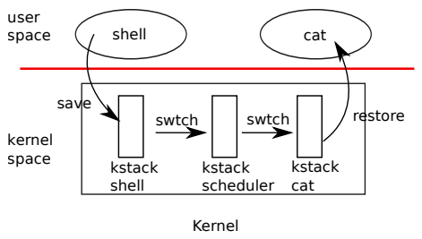
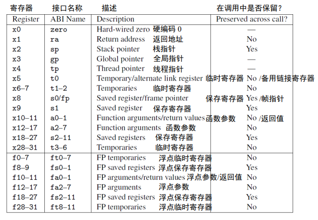
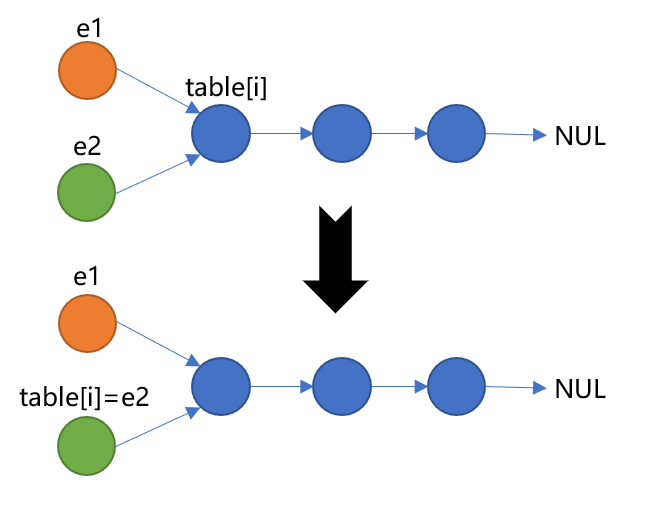

# Multithreading-Lab

## Scheduling

一个操作系统可能需要运行的进程数大于计算机的核心数量，一个解决方案是让进程**分时共用(time-share)**处理器

这种共用对于进程来说需要是隐藏的，即给进程一种它是在独占CPU的假象

### Multiplexing

Xv6可能在两种情况下会发生CPU的复用(即从一个进程切换到另一个)

- 当一个进程在等待设备/管道I/O完成或者等待子进程退出或者`sleep`时，`sleep`和`walkup`机制导致进程切换
- 周期性强制切换，防止计算密集型进程一直占用CPU

实验CPU复用会出现如下挑战

- 如何实现进程的切换
- 如何实现进程强制切换，同时对进程隐藏切换的事实
- 多个CPU可能并行地切换进程，需要加锁来防止竞争
- 当进程退出时必须释放掉占用的内存和其它资源，但是它不能独立完成所有工作，例如当内核栈还在使用时不能释放它的内核栈
- 多核机器的每个核心必须记住它正在执行哪个进程，从而使得系统调用影响正确进程的内核栈
- `sleep`允许进程让出CPU并且睡眠来等待某个事件，`wakeup`允许其他进程将该进程唤醒，需要小心使用避免竞争

### Code: Context switching

下图展示了切换用户进程的大致步骤

- 用户/内核态的切换(发生系统调用/中断)，控制转移到旧进程的内核线程
- 上下文切换，控制转移到当前CPU的调度线程
- 上下文切换，控制转移到新进程的内核线程
- 从陷阱返回到新进程



xv6的调度器对于每个CPU都有一个独立线程(保存寄存器和栈)

线程切换涉及到保存旧线程的CPU寄存器和恢复新线程之前保存过的寄存器；栈指针`sp`和程序计数器`pc`的保存和恢复意味着内核栈的切换以及执行程序的切换

`swtch`函数起着线程切换时保存和恢复寄存器的作用，它并不直接认识线程，而是保存和恢复寄存器集合，将其称作为**上下文(context)**。当某个进程要让出CPU时，它的内核线程调用`swtch`来保存进程上下文并且恢复调度器的上下文。上下文被存储在结构体`struct context`中，这个结构体又被包含在一个进程的结构体`struct proc`中又或者是一个CPU的结构体`struct cpu`中。`swtch`函数接收两个参数，`struct context *old`和`struct context *new`，将旧的上下文保存在`old`中，并从`new`中恢复新的上下文，然后返回

```c
// kernel/defs.h
void swtch(struct context*, struct context*);

// kernel/proc.h
struct context {
    uint64 ra;
    uint64 sp;

    // callee-saved
    uint64 s0;
    uint64 s1;
    uint64 s2;
    uint64 s3;
    uint64 s4;
    uint64 s5;
    uint64 s6;
    uint64 s7;
    uint64 s8;
    uint64 s9;
    uint64 s10;
    uint64 s11;
};

struct cpu {
  struct proc *proc;          // The process running on this cpu, or null.
  struct context context;     // swtch() here to enter scheduler().
  int noff;                   // Depth of push_off() nesting.
  int intena;                 // Were interrupts enabled before push_off()?
};

struct proc {
  struct spinlock lock;

  // p->lock must be held when using these:
  enum procstate state;        // Process state
  struct proc *parent;         // Parent process
  void *chan;                  // If non-zero, sleeping on chan
  int killed;                  // If non-zero, have been killed
  int xstate;                  // Exit status to be returned to parent's wait
  int pid;                     // Process ID

  // these are private to the process, so p->lock need not be held.
  uint64 kstack;               // Virtual address of kernel stack
  uint64 sz;                   // Size of process memory (bytes)
  pagetable_t pagetable;       // User page table
  struct trapframe *trapframe; // data page for trampoline.S
  struct context context;      // swtch() here to run process
  struct file *ofile[NOFILE];  // Open files
  struct inode *cwd;           // Current directory
  char name[16];               // Process name (debugging)
};
```

一个造成上下文切换的例子就是中断，`usertrap`中调用`yield`，然后`yield`中又会调用`sched`，`sched`中调用`swtch`函数来切换上下文，将当且上下文保存在`p->context`中，然后切换到调度器的上下文，其之前保存在`mycpu()->context`中

```c
// kernel/trap.c
void
usertrap(void)
{
	...
        
    // give up the CPU if this is a timer interrupt.
    if(which_dev == 2)
        yield();

    usertrapret();
}

// kernel/proc.c
void
yield(void)
{
    struct proc *p = myproc();
    acquire(&p->lock);
    p->state = RUNNABLE;
    sched();
    release(&p->lock);
}

void
sched(void)
{
    int intena;
    struct proc *p = myproc();

    if(!holding(&p->lock))
        panic("sched p->lock");
    if(mycpu()->noff != 1)
        panic("sched locks");
    if(p->state == RUNNING)
        panic("sched running");
    if(intr_get())
        panic("sched interruptible");

    intena = mycpu()->intena;
    swtch(&p->context, &mycpu()->context);
    mycpu()->intena = intena;
}
```

`swtch`的代码在`kernel/swtch.S`中，它只保存被调用者保存寄存器，调用者保存寄存器被保存在栈上如果需要保存的话



|                 寄存器类型                 |                             解释                             |
| :----------------------------------------: | :----------------------------------------------------------: |
|  调用者保存寄存器(caller-saved registers)  | 又称为易失性寄存器，存储的是临时数据；如果调用者需要保证调用过程前后这些寄存器值不变，需要将它们保存在自己的栈上 |
| 被调用者保存寄存器(callee-saved registers) | 又称为非易失性寄存器，存储长生命周期数据，整个调用过程需要保证其值不变；由被调用者保存这些寄存器，并在调用返回时恢复这些寄存器 |

`swtch`并没有保存程序计数器`pc`，它保存的是`ra`寄存器，`ra`寄存器保存了调用`swtch`的函数从`swtch`返回时的地址。现在`swtch`从新的上下文中恢复寄存器，新的上下文是在一个之前的`swtch`保存的。当`swtch`返回时，从地址`ra`处的指令继续执行，这个`ra`是从新的上下文中恢复的`ra`，也就是新线程之前调用`swtch`的地址。除此之外，还会返回到新线程的栈上

在我们的例子中，`sched`调用`swtch`来切换到`cpu()->context`，也就是每个CPU调度器内核线程的上下文。这个上下文之前被`scheduler`中调用的`swtch`所保存。当`sched`中的`swtch`调用结束后，返回到的不是`sched`，而是`cpu()->context->ra`，即`scheduler`中，而且`sp`也会切换成`cpu()->context->sp`即调度器线程的栈

```asm
.globl swtch
swtch:
        sd ra, 0(a0)
        sd sp, 8(a0)
        sd s0, 16(a0)
        sd s1, 24(a0)
        sd s2, 32(a0)
        sd s3, 40(a0)
        sd s4, 48(a0)
        sd s5, 56(a0)
        sd s6, 64(a0)
        sd s7, 72(a0)
        sd s8, 80(a0)
        sd s9, 88(a0)
        sd s10, 96(a0)
        sd s11, 104(a0)

        ld ra, 0(a1)
        ld sp, 8(a1)
        ld s0, 16(a1)
        ld s1, 24(a1)
        ld s2, 32(a1)
        ld s3, 40(a1)
        ld s4, 48(a1)
        ld s5, 56(a1)
        ld s6, 64(a1)
        ld s7, 72(a1)
        ld s8, 80(a1)
        ld s9, 88(a1)
        ld s10, 96(a1)
        ld s11, 104(a1)
        
        ret
```

### Code: Scheduling

`scheduler`函数的作用是选择当前CPU下一个运行的进程。一个进程如果要让出CPU，必须对进程锁`p->lock`加锁并且释放该进程持有的其他锁，更新进程状态`p->state`，然后调用`sched`。`sched`再次检查进程相关状态，其中一个检查是中断是否关闭。最后，`sched`调用`swtch`来将当前上下文保存在`p->context`中，并从调度器上下文`cpu()->context`中恢复寄存器。`swtch`返回到调度器线程的栈上，继续`scheduler`函数中的for循环，找到一个可运行进程，切换到它，如此往复

xv6持有锁`p->lock`横跨整个`swtch`调用: `swtch`的调用者必须持有该锁，之后锁的持有权被传递到`swtch`跳转到的代码。这种关于锁的约定并不常见，通常一个线程如果持有该锁，那么它就有责任释放该锁。但是对于上下文切换来说，打破这种约定很有必要，如果在执行`swtch`前`p->lock`没有加锁，当前进程的内核线程在`yield`种将`p->state`修改为`RUNNALBE`之后(此时当前进程的内核线程还在运行)，其它CPU的调度器线程看到这个进程是可运行的，便执行调度，也就是说两个CPU在同一个栈上运行，可能导致灾难性的后果

```c
// CPU1执行当前进程的内核线程，yield将p->state修改为RUNNABLE
void
yield(void)
{
    struct proc *p = myproc();
    // acquire(&p->lock);
    p->state = RUNNABLE;
    sched();
    // release(&p->lock);
}

// CPU2的调度器线程正在执行scheduler
void
scheduler(void)
{
    struct proc *p;
    struct cpu *c = mycpu();

    c->proc = 0;
    for(;;){
        // Avoid deadlock by ensuring that devices can interrupt.
        intr_on();

        int nproc = 0;
        for(p = proc; p < &proc[NPROC]; p++) {
            // 获取进程p的锁
            // 假设在yield中没有加锁，此处就成功了
            acquire(&p->lock);
            if(p->state != UNUSED) {
                nproc++;
            }
            // 加锁成功后，发现p是可运行的，然后调度
            if(p->state == RUNNABLE) {
                p->state = RUNNING;
                c->proc = p;
                swtch(&c->context, &p->context);
                
                c->proc = 0;
            }
            release(&p->lock);
        }
        if(nproc <= 2) {   // only init and sh exist
            intr_on();
            asm volatile("wfi");
        }
    }
}
```

一个内核线程总是在`sched`中让出CPU，然后切换到调度器线程，而调度器线程执行`scheduler`中的`swtch`又会切换到一个之前调用了`sched`的内核线程。

有一种情况从`scheduler`的`swtch`调用返回后，不是跳转到`sched`。当一个进程`p`第一次被调度时，跳转到`forkret`开始处继续执行，`forkret`将`p->lock`释放掉(在`scheduler`中被加锁)

```c
static struct proc*
allocproc(void)
{
    ...
    // 一个新进程的ra被设置为forkret
    p->context.ra = (uint64)forkret;
    p->context.sp = p->kstack + PGSIZE;

    return p;
}

void
forkret(void)
{
    static int first = 1;

    // Still holding p->lock from scheduler.
    release(&myproc()->lock);

    if (first) {
        // File system initialization must be run in the context of a
        // regular process (e.g., because it calls sleep), and thus cannot
        // be run from main().
        first = 0;
        fsinit(ROOTDEV);
    }

    usertrapret();
}
```

`scheduler`执行一个简单循环: 遍历进程表找到一个状态为`RUNNABLE`的进程，更新当前CPU执行进程`c->proc`为`p`，将`p`的状态`p->state`修改为`RUNNING`，然后调用`swtch`切换到`p`

这些调度相关代码对于每个进程`p`维护了一个不变量集合，并且无论何时这些不变量不正确时持有锁`p->lock`。进程`p`的不变量如下

- 如果进程状态为`RUNNING`，定时器中断的`yield`必须能安全地从该进程切出，这意味着CPU寄存器必须持有进程的寄存器值(比如`swtch`没有将进程寄存器保存到`context`中)，并且`c->proc`必须指向当前进程
- 如果进程状态为`RUNNABLE`，一个空闲CPU的调度器执行这个进程必须是安全的，这意味着`p->context`必须保存了进程的寄存器值(而不是在真实的CPU寄存器中)，且没有CPU正在这个进程的内核栈上执行，没有CPU的`c->proc`指向这个进程

### Code: mycpu and myproc

Xv6通常需要一个指针来指向当前运行进程的`proc`结构体。在单处理器上，只需要一个全局变量即可，但是在多核处理器上这样不行，因为每个核心运行的进程不同。解决这个问题的关键是认识到每个核心都有一组寄存器，我们只需要利用其中一个来记录每个核的信息

Xv6为每个CPU维护了一个结构体`struct cpu`，它记录了当前CPU正在运行的进程、当前CPU调度器线程保存的寄存器以及自旋锁的嵌套层数。函数`mycpu`返回一个指向当前CPU的`struct cpu`结构体的指针。RISC-V用`harid`为每个CPU标号，Xv6确保了在内核中时当前CPU的`hartid`被存储在这个`CPU`的`tp`寄存器中，这使得`mycpu`函数可以通过`tp`来索引`cpu`结构体数组来找到正确的项

确保一个CPU的`hartid`总是存储在`tp`寄存器中有一点复杂。`mstart`在CPU的启动顺序中设置了`tp`寄存器，这时CPU还处于机器模式。`usertrapret`将`tp`寄存器存储在`trapframe`页面中，因为用户进程可能修改`tp`寄存器。当从用户空间进入内核空间时，`uservec`恢复之前保存的`tp`寄存器。如果RISC-V允许xv6直接读取当前CPU的`hartid`将非常便利，但是这种操作只允许在机器模式下进行，而在监管模式下是不被允许的

```c
// kernel/trap.c
void
usertrapret(void)
{
    struct proc *p = myproc();

    intr_off();
    w_stvec(TRAMPOLINE + (uservec - trampoline));

    p->trapframe->kernel_satp = r_satp();         // kernel page table
    p->trapframe->kernel_sp = p->kstack + PGSIZE; // process's kernel stack
    p->trapframe->kernel_trap = (uint64)usertrap;
    p->trapframe->kernel_hartid = r_tp();         // hartid for cpuid()

    ...
}

// kernel/trampoline.S
uservec:    
		...
        # make tp hold the current hartid, from p->trapframe->kernel_hartid
        ld tp, 32(a0)
		...
```

函数`cpuid`和`mycpu`的返回值是不可靠的，当定时器中断造成线程`yield`然后切换到另一个CPU时，返回值将不再正确。为了避免这个问题，xv6要求调用者禁用中断直到使用完函数返回的`struct cpu`

`myproc`函数返回一个指向运行在当前CPU的进程的`struct proc`结构体。`myproc`禁用了中断，调用`mycpu`函数，从`mycpu`返回的结构体中提取`mycpu()->proc`，然后启用中断。`myproc`函数的返回值是可靠的，即便中断被使能

## _Uthread: switching between threads (<font color=0000ff><u>moderate.</u></font>)_

在这个练习中，需要为用户级线程设计上下文切换机制，`user/uthread.c`中已经实现了大部分机制。现在需要实现的是创建一个线程和在线程切换的函数

首先，和进程一样，用户线程也需要上下文，由之前的知识可知上下文只需要存储`ra`,`sp`和被调用者保存寄存器，再`user/uthread.c`中定义`thread_context`结构体

```c
struct thread_context {
    uint64 ra;
    uint64 sp;

    // callee-saved
    uint64 s0;
    uint64 s1;
    uint64 s2;
    uint64 s3;
    uint64 s4;
    uint64 s5;
    uint64 s6;
    uint64 s7;
    uint64 s8;
    uint64 s9;
    uint64 s10;
    uint64 s11;
};
```

在`thread`结构体中添加`context`成员

```c
struct thread {
    char       stack[STACK_SIZE]; /* the thread's stack */
    int        state;             /* FREE, RUNNING, RUNNABLE */
    struct thread_context context;
};
```

我们需要一个线程第一次被调度时，从传递给`thread_create`函数的函数指针`func`的入口开始，在该线程的栈中执行，可以仿照`allocproc`来写

```c
void 
thread_create(void (*func)())
{
    struct thread *t;

    for (t = all_thread; t < all_thread + MAX_THREAD; t++) {
        if (t->state == FREE) break;
    }
    t->state = RUNNABLE;
    // YOUR CODE HERE
    memset(&t->context, 0, sizeof(t->context));
    // 第一次调度完成后新线程从func入口处执行
    t->context.ra = (uint64)func;
    // 栈指针sp设置为线程t的stack
    t->context.sp = (uint64)t->stack + STACK_SIZE;
}
```

实现线程上下文切换函数`thread_switch`，仿照`kernel/swtch.S`在`user/uthread_switch.S`中实现即可

```asm
thread_switch:
	/* YOUR CODE HERE */
	sd ra, 0(a0)
	sd sp, 8(a0)
	sd s0, 16(a0)
	sd s1, 24(a0)
	sd s2, 32(a0)
	sd s3, 40(a0)
	sd s4, 48(a0)
	sd s5, 56(a0)
	sd s6, 64(a0)
	sd s7, 72(a0)
	sd s8, 80(a0)
	sd s9, 88(a0)
	sd s10, 96(a0)
	sd s11, 104(a0)

	ld ra, 0(a1)
	ld sp, 8(a1)
	ld s0, 16(a1)
	ld s1, 24(a1)
	ld s2, 32(a1)
	ld s3, 40(a1)
	ld s4, 48(a1)
	ld s5, 56(a1)
	ld s6, 64(a1)
	ld s7, 72(a1)
	ld s8, 80(a1)
	ld s9, 88(a1)
	ld s10, 96(a1)
	ld s11, 104(a1)
	ret    /* return to ra */
```

线程调度器`thread_schedule`首先找到一个可运行线程(`t->state`为`RUNNABLE`)，然后将`current_thread`置为找到的可运行线程，我们需要在这里调用`thread_switch`函数来完成上下文切换

```c
void 
thread_schedule(void)
{
    struct thread *t, *next_thread;

    /* Find another runnable thread. */
    next_thread = 0;
    t = current_thread + 1;
    for(int i = 0; i < MAX_THREAD; i++){
        if(t >= all_thread + MAX_THREAD)
            t = all_thread;
        if(t->state == RUNNABLE) {
            next_thread = t;
            break;
        }
        t = t + 1;
    }

    if (next_thread == 0) {
        printf("thread_schedule: no runnable threads\n");
        exit(-1);
    }

    if (current_thread != next_thread) {         /* switch threads?  */
        next_thread->state = RUNNING;
        t = current_thread;
        current_thread = next_thread;
        /* YOUR CODE HERE
     * Invoke thread_switch to switch from t to next_thread:
     * thread_switch(??, ??);
     */
        thread_switch((uint64)&t->context, (uint64)&next_thread->context);
    } else
        next_thread = 0;
}
```

最后编译，执行`uthread`，结果如下

```sh
$ uthread
thread_a started
thread_b started
thread_c started
thread_c 0
thread_a 0
thread_b 0
thread_c 1
thread_a 1
thread_b 1
thread_c 2
...
thread_b 98
thread_c 99
thread_a 99
thread_b 99
thread_c: exit after 100
thread_a: exit after 100
thread_b: exit after 100
thread_schedule: no runnable threads
```

`make grade`，可以看出该部分实验通过

```sh
$ make qemu-gdb
uthread: OK (3.3s)
```

## _Using threads (<font color=0000ff><u>moderate.</u></font>)_

这部分实验主要是熟悉`pthread`库

### 测试代码分析

首先是宏定义，结构体和一些全局变量，`entry`指的是哈希表条目，`table`是哈希表，它有`NBUCKET`个槽位，在后面我们可以知道它是通过拉链法的形式来解决哈希冲突的，`NKEYS`则是要写入哈希表的关键字数量，`nthread`是线程数量，通过`argv[1]`传进来

```c
// notxv6/ph.c

#define NBUCKET 5
#define NKEYS 100000

struct entry {
    int key;
    int value;
    struct entry *next;
};
struct entry *table[NBUCKET];
int keys[NKEYS];
int nthread = 1;
```

再看一下`main`函数，它主要是调用`pthread_create`函数来创建线程执行`put_thread`或者`get_thread`，调用`pthread_join`来同步线程

```c
int
main(int argc, char *argv[])
{
	...
    // 生成随机关键字数组
    for (int i = 0; i < NKEYS; i++) {
        keys[i] = random();
    }

	// nthread个put线程: 调用put_thread函数将关键字数组写入哈希表 
    t0 = now();
    for(int i = 0; i < nthread; i++) {
        assert(pthread_create(&tha[i], NULL, put_thread, (void *) (long) i) == 0);
    }
    for(int i = 0; i < nthread; i++) {
        assert(pthread_join(tha[i], &value) == 0);
    }
    t1 = now();

    printf("%d puts, %.3f seconds, %.0f puts/second\n",
           NKEYS, t1 - t0, NKEYS / (t1 - t0));

	// nthread个get线程: 调用get_thread从哈希表中读取关键字数组中的关键字
    t0 = now();
    for(int i = 0; i < nthread; i++) {
        assert(pthread_create(&tha[i], NULL, get_thread, (void *) (long) i) == 0);
    }
    for(int i = 0; i < nthread; i++) {
        assert(pthread_join(tha[i], &value) == 0);
    }
    t1 = now();

    printf("%d gets, %.3f seconds, %.0f gets/second\n",
           NKEYS*nthread, t1 - t0, (NKEYS*nthread) / (t1 - t0));
}
```

`put_thread`将关键字数组共`NKEYS`个关键字划分成`nthread`份，每份为数组中连续的`b = NKEYS/nthread`个关键字，由每个线程调用`put`函数负责写入哈希表中

`put`函数首先根据关键字`key`取余得到的结果决定要写入哪一个槽位中，代码中是`table[i]`，而这里的哈希表是采用拉链法来解决哈希冲突的，即每个槽位实际上是一个链表。然后`put`遍历链表`table[i]`，查找是否存在关键字为`key`的条目，存在的话就将其值修改为`value`，否则调用`insert`函数来添加`(key, value)`

最后是`insert`函数，它首先是创建一个条目`e`，并将`(key, value)`写入`e`中，然后是采用头插法将`e`加入链表`table[i]`，结束后`table[i]`即为新增条目

```c
static void 
insert(int key, int value, struct entry **p, struct entry *n)
{
    struct entry *e = malloc(sizeof(struct entry));
    e->key = key;
    e->value = value;
    // 头插法
    e->next = n;
    *p = e;
}

static 
void put(int key, int value)
{
    int i = key % NBUCKET;

    // is the key already present?
    struct entry *e = 0;
    for (e = table[i]; e != 0; e = e->next) {
        if (e->key == key)
            break;
    }
    if(e){
        // update the existing key.
        e->value = value;
    } else {
        // the new is new.
        insert(key, value, &table[i], table[i]);
    }
}

static void *
put_thread(void *xa)
{
    int n = (int) (long) xa; // thread number
    int b = NKEYS/nthread;

    for (int i = 0; i < b; i++) {
        put(keys[b*n + i], n);
    }

    return NULL;
}
```

`get_thread`目的是测试是否有关键字丢失，每个线程都调用`get_thread`来检查整个`keys`数组，`get_thread`又调用`get`来找到哈希表中关键字为`key`的条目，如果找不到，则说明之前写入关键字失败，`get_thread`打印丢失的关键字数目

```c
static struct entry*
get(int key)
{
    int i = key % NBUCKET;

    struct entry *e = 0;
    for (e = table[i]; e != 0; e = e->next) {
        if (e->key == key) break;
    }

    return e;
}

static void *
get_thread(void *xa)
{
    int n = (int) (long) xa; // thread number
    int missing = 0;

    for (int i = 0; i < NKEYS; i++) {
        struct entry *e = get(keys[i]);
        if (e == 0) missing++;
    }
    printf("%d: %d keys missing\n", n, missing);
    return NULL;
}
```

### 实验目的

`make ph`来编译`notxv6/ph.c`，在终端输入`./ph 1`，打印信息如下

```sh
$ ./ph 1
100000 puts, 5.153 seconds, 19407 puts/second
0: 0 keys missing
100000 gets, 5.159 seconds, 19384 gets/second
```

线程0打印`0 keys missing`说明所有关键字均成功写入哈希表中

如果采用多线程呢，在终端输入`./ph 2`，打印信息如下

```sh
$ ./ph 2
100000 puts, 2.653 seconds, 37696 puts/second
0: 16289 keys missing
1: 16289 keys missing
200000 gets, 6.577 seconds, 30408 gets/second
```

可以看到线程0和1均打印了`16289 keys missing`，代表有些关键字的写入丢失了；另一方面，从两次执行结果对比可以看出，多线程确实加快了写入速率

接下来要就解决的问题就是为什么单线程不会造成写入丢失，而多线程就会出现此问题

```
Why are there missing keys with 2 threads, but not with 1 thread? Identify a sequence of events with 2 threads that can lead to a key being missing. Submit your sequence with a short explanation in answers-thread.txt
```

这实际上是一个多线程同时写入时造成的丢失修改问题，假设线程1和线程2同时对链表`table[i]`做修改(由于测试的是关键字是否成功写入，我们不关心对某个条目`e->value`修改的竞争问题，关心的是对链表结构修改的竞争问题)，线程1要将条目`e1`插入`table[i]`，线程2要将条目`e2`插入`table[i]`，则以下执行顺序将导致`e1`丢失

```c
e1->next = table[i];	// thread 1
e2->next = table[i];	// thread 2
table[i] = e1;			// thread 1
table[i] = e2;			// thread 2
```



### 解决方案

为了解决竞争问题，需要引入锁，保证下面两句是一个原子操作

```c
e->next = table[i];
table[i] = e;
```

创建全局变量`lock`

```c
pthread_mutex_t lock;
```

在`main`中用函数`pthread_mutex_init`来初始化`lock`

```c
int 
main(int argc, char *argv[]) 
{
	...
    pthread_mutex_init(&lock, NULL);
    ...
}
```

在`put`中操作`lock`，使得`insert`在临界区中

```c
static 
void put(int key, int value)
{
    int i = key % NBUCKET;

    // is the key already present?
    struct entry *e = 0;
    for (e = table[i]; e != 0; e = e->next) {
        if (e->key == key)
            break;
    }
    if(e){
        // update the existing key.
        e->value = value;
    } else {
        // the new is new.
        // 临界区
        pthread_mutex_lock(&lock);
        insert(key, value, &table[i], table[i]);
        pthread_mutex_unlock(&lock);
    }
}
```

再次`make ph`编译，并执行`./ph 2`结果如下

```sh
$ ./ph 2
100000 puts, 3.027 seconds, 33035 puts/second
1: 0 keys missing
0: 0 keys missing
200000 gets, 5.435 seconds, 36796 gets/second
```

#### 优化

实际上我们可以使用粒度更加细的锁，因为当两个线程修改不同的链表时，其实是不造成竞争的，因此可以位哈希表的每个槽位设置一个锁

```c
pthread_mutex_t lock[NBUCKET];

static 
void put(int key, int value)
{
    int i = key % NBUCKET;

    // is the key already present?
    struct entry *e = 0;
    for (e = table[i]; e != 0; e = e->next) {
        if (e->key == key)
            break;
    }
    if(e){
        // update the existing key.
        e->value = value;
    } else {
        // the new is new.
        // 临界区
        pthread_mutex_lock(&lock[i]);
        insert(key, value, &table[i], table[i]);
        pthread_mutex_unlock(&lock[i]);
    }
}

int 
main(int argc, char *argv[]) 
{
	...
    for (int i = 0; i < NBUCKET; i++)
	    pthread_mutex_init(&lock[i], NULL);
    ...
}
```

再次`make ph`编译，执行`./ph 2`，结果如下

```sh
100000 puts, 3.003 seconds, 33298 puts/second
1: 0 keys missing
0: 0 keys missing
200000 gets, 5.423 seconds, 36878 gets/second
```

可以看到和优化前写入效率相差不大，这是因为测试和当前计算机负荷等因素有关，造成结果方差较大

执行`make grade`可以看到通过了`ph_safe`和`ph_fast`测试

```sh
$ make grade
...
uthread: OK (3.0s)
...
ph_safe: OK (8.7s)
...
ph_fast: OK (19.4s)
...
```

## _Barrier (<font color=0000ff><u>moderate.</u></font>)_

本节实验要求我们实现**同步屏障(Barrier)**，维基百科关于此条目解释如下

```
同步屏障(Barrier)是并行计算中的一种同步方法。对于一群进程或线程，程序中的一个同步屏障意味着任何线程/进程执行到此后必须等待，直到所有线程/进程都到达此点才可继续执行下文。
```

### 测试代码分析

全局变量和结构体: `nthread`和上节一样为线程数量，通过`argv[1]`传入；`barrier`结构体包含一个互斥锁`barrier.barrier_mutex`，一个条件变量`barrier.barrier_cond`，`barrier.nthread`用来记录当前轮到达`barrier()`的线程数，`barrier.round`记录当前轮数

```c
static int nthread = 1;
static int round = 0;

struct barrier {
    pthread_mutex_t barrier_mutex;
    pthread_cond_t barrier_cond;
    int nthread;      // Number of threads that have reached this round of the barrier
    int round;     // Barrier round
} bstate;
```

`main`函数调用`barrier_init`来初始化`bstate.barrier_mutx`和`bstate.barrier_cond`，然后调用`pthread_create`创建`nthread`个线程，线程开始执行时调用`thread`函数，然后调用`pthread_join`来同步线程

```c
static void
barrier_init(void)
{
    assert(pthread_mutex_init(&bstate.barrier_mutex, NULL) == 0);
    assert(pthread_cond_init(&bstate.barrier_cond, NULL) == 0);
    bstate.nthread = 0;
}

int
main(int argc, char *argv[])
{
    pthread_t *tha;
    void *value;
    long i;
    double t1, t0;

    if (argc < 2) {
        fprintf(stderr, "%s: %s nthread\n", argv[0], argv[0]);
        exit(-1);
    }
    nthread = atoi(argv[1]);
    tha = malloc(sizeof(pthread_t) * nthread);
    srandom(0);

    barrier_init();

    for(i = 0; i < nthread; i++) {
        assert(pthread_create(&tha[i], NULL, thread, (void *) i) == 0);
    }
    for(i = 0; i < nthread; i++) {
        assert(pthread_join(tha[i], &value) == 0);
    }
    printf("OK; passed\n");
}
```

`thread`函数主要是进行一个for循环，每次循环为一轮，每轮都会调用`assert(i == t)`来判断所有线程是否同步，其中关键函数`barrier`尚未实现

```c
static void *
thread(void *xa)
{
    long n = (long) xa;
    long delay;
    int i;

    for (i = 0; i < 20000; i++) {
        int t = bstate.round;
        assert (i == t);
        barrier();
        printf("%ld after barrier, turn: %d\n", n, i);
        usleep(random() % 100);
    }

    return 0;
}
```

### 实验目的

执行`make barrier`来编译`notxv6/barrier.c`，执行`./barrier 2`，结果如下

```sh
$ ./barrier 2
barrier: notxv6/barrier.c:54: thread: Assertion `i == t' failed.
barrier: notxv6/barrier.c:54: thread: Assertion `i == t' failed.
Aborted
```

发现进程中止了，原因是尚未实现`barrier`函数，从而导致线程不同步，在线程执行的`thread`中的`assert`条件不满足

现在要实现`barrier`函数，使得成功通过测试

### 解决方案

每个线程到达`barrier()`中应当首先获取锁`bstate.barrier_mutex`，然后将`bstate.nthread`加1代表当前线程到达了`barrier()`，然后比较`bstate.nthread`和`nthread`，如果不相等说明还有线程没有进入`barrier()`，调用`pthread_cond_wait`使线程休眠，直到最后一个线程到达`barrier()`，满足条件`bstate.nthread == nthread`，最后一个线程先将`bstate.nthread`置0为下一轮做准备，将`bstate.round`加1，然后调用`pthread_cond_broadcast`唤醒所有等待`bstate.barrier_cond`的线程

```c
static void 
barrier()
{
    pthread_mutex_lock(&bstate.barrier_mutex);
    bstate.nthread++;
    if (bstate.nthread == nthread) {
        bstate.nthread = 0;
        bstate.round += 1;
        pthread_cond_broadcast(&bstate.barrier_cond);
    }
    else
        pthread_cond_wait(&bstate.barrier_cond, &bstate.barrier_mutex);
    pthread_mutex_unlock(&bstate.barrier_mutex);
}
```

执行`make barrier`编译，然后执行`./barrier 2`，结果如下

```sh
$ ./barrier 2
OK; passed
```

尝试增加线程数量，`./barrier 10`，结果如下

```sh
$ ./barrier 10
OK; passed
```

执行`make grade`，结果如下

```sh
$ make grade
...
uthread: OK (3.2s)
== Test answers-thread.txt == answers-thread.txt: OK
== Test ph_safe == make[1]: Entering directory '/home/hikari007/xv6-labs-2020'
make[1]: 'ph' is up to date.
make[1]: Leaving directory '/home/hikari007/xv6-labs-2020'
ph_safe: OK (8.2s)
== Test ph_fast == make[1]: Entering directory '/home/hikari007/xv6-labs-2020'
make[1]: 'ph' is up to date.
make[1]: Leaving directory '/home/hikari007/xv6-labs-2020'
ph_fast: OK (18.7s)
== Test barrier == make[1]: Entering directory '/home/hikari007/xv6-labs-2020'
make[1]: 'barrier' is up to date.
make[1]: Leaving directory '/home/hikari007/xv6-labs-2020'
barrier: OK (3.2s)
== Test time ==
time: OK
Score: 60/60
```

