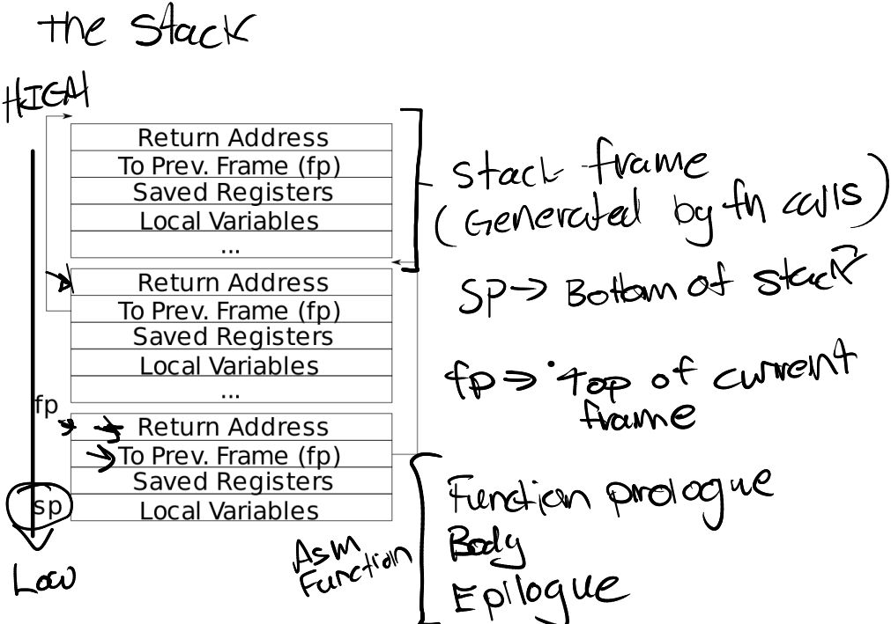
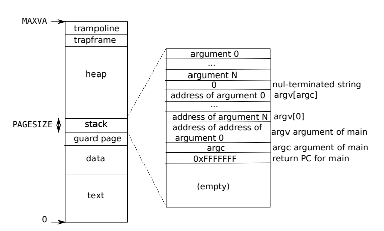
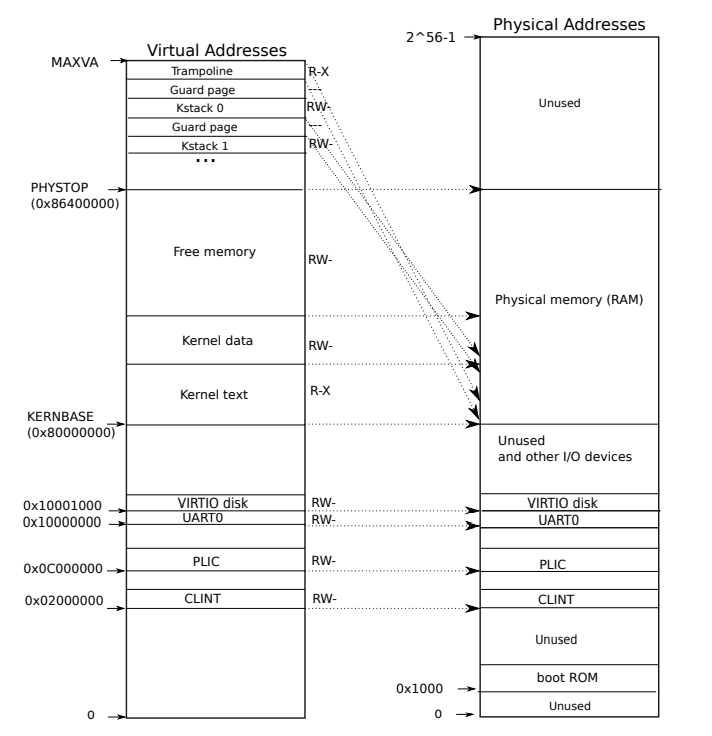
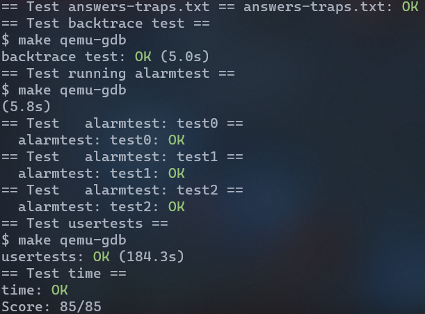

# Trap-Lab

## _RISC-V assembly (<font color=00ff00><u>easy.</u></font>)_

查看文件`user/call.c`，执行`make fs.img`后会产生一个对应的汇编文件`user/call.asm`，查看汇编文件中的函数`f`,`g`和`main`，然后回答下面几个问题

函数`g`及其汇编:

```c
int g(int x) {
  return x+3;
}
```

```asm
0000000000000000 <g>:

int g(int x) {
   0:	1141                	addi	sp,sp,-16
   2:	e422                	sd	s0,8(sp)
   4:	0800                	addi	s0,sp,16
  return x+3;
}
   6:	250d                	addiw	a0,a0,3
   8:	6422                	ld	s0,8(sp)
   a:	0141                	addi	sp,sp,16
   c:	8082                	ret
```

函数`f`及其汇编:

```c
int f(int x) {
  return g(x);
}
```

```asm
000000000000000e <f>:

int f(int x) {
   e:	1141                	addi	sp,sp,-16
  10:	e422                	sd	s0,8(sp)
  12:	0800                	addi	s0,sp,16
  return g(x);
}
  14:	250d                	addiw	a0,a0,3
  16:	6422                	ld	s0,8(sp)
  18:	0141                	addi	sp,sp,16
  1a:	8082                	ret
```

`main`及其汇编:

```c
void main(void) {
  printf("%d %d\n", f(8)+1, 13);
  exit(0);
}
```

```asm
000000000000001c <main>:

void main(void) {
  1c:	1141                	addi	sp,sp,-16
  1e:	e406                	sd	ra,8(sp)
  20:	e022                	sd	s0,0(sp)
  22:	0800                	addi	s0,sp,16
  printf("%d %d\n", f(8)+1, 13);
  24:	4635                	li	a2,13
  26:	45b1                	li	a1,12
  28:	00000517          	auipc	a0,0x0
  2c:	7b050513          	addi	a0,a0,1968 # 7d8 <malloc+0xea>
  30:	00000097          	auipc	ra,0x0
  34:	600080e7          	jalr	1536(ra) # 630 <printf>
  exit(0);
  38:	4501                	li	a0,0
  3a:	00000097          	auipc	ra,0x0
  3e:	27e080e7          	jalr	638(ra) # 2b8 <exit>
```

```
Which registers contain arguments to functions? For example, which register holds 13 in main's call to printf?
```

由`main`中的`li a2,13`可知13存放在`a2`寄存器中

```
Where is the call to function f in the assembly code for main? Where is the call to g? (Hint: the compiler may inline functions.)
```

查看`main`的汇编代码发现只有`jalr 1536(ra)`这一句是跳转到`printf`函数，没有语句跳转到`f`函数，这里实际上是编译器作了优化处理，将`f(8) + 1`直接换成数字12，即对应`li a1,12`

`f`函数本来是会调用`g`函数的，但是查看`f`的汇编代码可以发现编译器也是做了内联优化，即将`return g(x)`优化成`addiw a0,a0,3`

```
At what address is the function printf located?
```

根据注释可知`printf`地址为`0000000000000630`

```
What value is in the register ra just after the jalr to printf in main?
```

`auipc ra,0x0`的作用是将`pc`加立即数的结果存到`ra`寄存器中，即`ra=0x30`；下一句`jalr 1536(ra)` 的作用是将`ra`加立即数的结果赋给`pc`，即`pc=0x30+1536=0x630`，并且原`pc`加4的结果存放到`ra`寄存器，即`ra=0x34+4=0x38`，即跳转到`printf`后，`ra`寄存器中的值为`0x38`

```
Run the following code.

	unsigned int i = 0x00646c72;
	printf("H%x Wo%s", 57616, &i);

What is the output? 

The output depends on that fact that the RISC-V is little-endian. If the RISC-V were instead big-endian what would you set i to in order to yield the same output? Would you need to change 57616 to a different value?
```

从地址`&i`开始的4个字节分别对应: `0x72-r`, `0x6c-l`, `0x64-d`, `0x00-NUL`，而57616对应的16进制为0xe110，则`printf`打印结果为`He110 World`

假设RISC-V为大端，想要得到相同的输出，则`i=0x726c6400`，数字57616不需要修改，无论大小端对应的都是数字`0xe110`，只是存储方式不同

```
In the following code, what is going to be printed after 'y='? (note: the answer is not a specific value.) Why does this happen?

	printf("x=%d y=%d", 3);
```

答案取决于当前`a2`寄存器的值，当前`a0`存的是格式串，`a1`存的是数字3

## _Backtrace (<font color=0000ff><u>moderate.</u></font>)_

为了方便调试，实现类似`gdb`的`bt`功能，打印调用栈中每个栈帧的返回地址，追溯调用过程

### 栈结构

如图所示，栈由多个栈帧组成，栈是由高地址向低地址增长的，`fp`寄存器存的是当前栈帧的顶部(高地址)，`sp`寄存器存的是栈顶地址(低地址)



那么打印整个栈，只需要根据当前栈帧指针`fp`计算出返回地址和上一个栈帧的`fp`，然后重复这个过程即可，关键在于什么时候停止

由上次实验可知，栈在整个用户地址空间中栈一个页的大小，可以先计算出栈基址`base=PGROUNDUP(fp)`，然后比较`fp`和`base`来判断是否停止



### Backtrace实现

首先我们需要获取当前栈帧的栈帧指针`fp`，根据实验提示，下面函数可以实现该功能，将其添加到`kernel/riscv.h`中

```c
static inline uint64
r_fp()
{
  uint64 x;
  asm volatile("mv %0, s0" : "=r" (x) );
  return x;
}
```

在`kernel/printf.c`中实现核心函数`backtrace()`，并且在`kernel/defs.h`中添加函数声明

```c
void
backtrace(void) 
{
  printf("backtrace:\n");
  uint64 fp = r_fp();
  // 栈占一个页，先计算出页的高地址
  uint64 base = PGROUNDUP(fp);

  while (fp < base) {
  	// 取出返回地址
    uint64 ra = *(uint64*)(fp - 8);
    // 取出上一个栈帧的fp
    fp = *(uint64*)(fp - 16);
    printf("%p\n", ra);
  }
}
```

在`kernel/sysproc.c`中的`sys_sleep`函数中调用`backtrace`

执行`make qemu`，然后执行`bttest`，可以得到如下输出:

```
$ bttest
backtrace:
0x0000000080002ce0
0x0000000080002ba6
0x0000000080002890
```

在`kernel/printf.c`中的`panic`函数中调用`backtrace`，这样以后每次panic时，便会打印栈帧

## _Alarm (<font color=ff0000><u>hard.</u></font>)_

### 实验要求

要求实现系统调用`sigalarm(interval, handler)`，要求应用程序每过`interval`个"ticks"，暂停执行，控制转移到`handler`，从`handler`返回后从暂停的地方继续执行；当一个程序调用`sigalarm(0, 0)`时应当取消注册时钟中断

### 陷阱和系统调用

有三种事件导致控制转移，如下:

|          陷阱类型          |                    解释                    |
| :------------------------: | :----------------------------------------: |
|   系统调用(System call)    |          应用程序执行`ecall`指令           |
|      异常(Exception)       | 用户/内核执行非法指令，如除零/访问非法地址 |
| 设备中断(Device interrupt) |               如硬盘完成读写               |

上面三种统称为**陷阱(Trap)**，陷阱的处理一般都是暂停执行原有程序，然后转入中断处理程序，处理完成后再从原来暂停的地方继续执行

我们希望陷阱对于应用程序是**透明的**，即应用程序意识不到陷阱的存在，这对于中断这一类型的陷阱尤为重要

一般陷阱的处理流程为: 

- 控制转移给内核
- 内核保存寄存器和一些状态
- 内核对陷阱执行相应的处理
- 内核恢复之前保存的寄存器和状态，从陷阱处理返回
- 从原来程序暂停的地方继续执行

#### RISC-V陷阱机制

RISC-V有一堆控制寄存器，内核将值写入这些寄存器太通知CPU如何处理陷阱

| 控制寄存器 |                             解释                             |
| :--------: | :----------------------------------------------------------: |
|  `stvec`   |    内核陷阱处理程序的地址写入这里，CPU跳转到这里处理陷阱     |
|   `sepc`   | 陷阱发生时，将`pc`的值写入这里(后来会将`pc`的值改变为`stvec`)；从陷阱返回时`sret`指令将`sepc`的值赋给`pc` |
|  `scause`  |                 将一个数字写入来表示陷阱原因                 |
| `sscratch` | 内核将进程的`trapframe`结构体(用来保存用户寄存器)地址存放在`sscratch`；一个进程创建时，就会分配一个页给`trapframe`，它的虚拟地址为`TRAPFRAME` |
| `sstatus`  | `SIE`位清零时，不会处理中断直到它被置位；`SPP`位表示陷阱是来自用户模式还是监管模式，这也是`sret`指令返回的模式 |

上面这些寄存器不能在用户模式下读写

当陷阱发生后，RISC-V硬件对所有陷阱(除了时钟中断)做如下操作:

- 如果陷阱类型为设备中断且`SIE`位被清零，不做响应
- 清零`SIE`位来关闭中断
- 将`pc`拷贝到`sepc`
- 将当且CPU模式(用户模式/监管模式)记录在`SPP`位中
- 将陷阱原因写入到`scause`寄存器
- CPU转变为监管模式
- 将`stvec`拷贝到`pc`
- 从新`pc`处继续执行

值得注意的是，CPU并不会切换到内核页表，不会切换到内核栈，也不会保存除了`pc`外的其它寄存器，这些任务必须**由内核完成**

#### 用户空间的陷阱

一个陷阱可能是来自用户空间的，有如下三种情况:

- 系统调用
- 非法操作(除零/访问非法地址)
- 设备中断

对于用户空间陷阱，处理流程为: `uservec`->`usertrap`->`usertrapret`->`userret`；其中`uservec`和`userret`来自`kernel/trampoline.S`，`usertrap`和`usertrapret`来自`kernel/trap.c`

前面说过，陷阱发生时CPU不会切换页表，因此用户页表必须包含`uservec`这段程序(`stvec`指向的地址)的映射；`uservec`必须切换到内核页表，且为了切换页表后能够继续执行，用户页表和内核页表应该对`uservec`做相同的映射，即虚拟地址一样，由上次实验可知，这一点是满足的，用户页表和内核页表的最高地址均有一页映射成`trampoline.S`，该页地址为`TRAMPOLINE`




##### uservec

`uservec`主要做了以下几件事:

- 交换`sscratch`和`a0`，然后`a0`即为`TRAPFRAME`
- 将用户寄存器保存在进程`p`的`p->trapframe`中，即`TRAPFRAME`这一页
- 从`p->trapframe`中取出内核栈地址、当前CPU的hartid、`usertrap`的地址以及切换成内核页表
- 控制转移给`usertrap`

```asm
.global uservec
uservec:    
		# CPU处于监管模式，但是页表还是用户页表
        # sscratch指向进程的trapframe，即sscratch为虚拟地址TRAPFRAME
        
        # 交换sscratch和a0
        csrrw a0, sscratch, a0

        # 将用户寄存器保存在TRAPFRAME这页中
        sd ra, 40(a0)
		...
        sd t6, 280(a0)
		
		# sscratch->t0->112(a0)
		# 将a0保存在p->trapframe->a0
        csrr t0, sscratch
        sd t0, 112(a0)

        # 从trapframe中取出内核栈地址
        ld sp, 8(a0)

        # 从trapframe中取出当前CPU的hartid
        ld tp, 32(a0)

        # 从trapframe中取出usertrap的地址
        ld t0, 16(a0)

        # 从trapframe中取出内核页表地址，并将satp寄存器置为它(切换成内核页表)
        ld t1, 0(a0)
        csrw satp, t1
        sfence.vma zero, zero

		# 此时a0已经没用，a0之前内容为TRAPFRAME，对于内核空间来说该页为guard page

        # 跳转到usertrap
        jr t0
```

##### usertrap

`usertrap`的作用是识别陷阱类型然后做相应处理，然后返回，它的作用为:

- 将`stvec`设置为`kernelvec`，因为当前在内核中，内核陷阱处理函数入口为`kernelvec`

- 保存`sepc`寄存器到`trapframe`，防止被覆盖

- 然后根据陷阱类型做相应处理，如下表

  | 陷阱类型 |        操作         |
  | :------: | :-----------------: |
  | 系统调用 | 由`syscall`函数处理 |
  | 设备中断 | 由`devintr`函数处理 |
  |   异常   |      杀掉进程       |

- 如果`p->killed`被置1，那么杀掉进程；如果陷阱为时钟中断，那么让出CPU

- 将控制转移给`usertrapret`

```c
void
usertrap(void)
{
  int which_dev = 0;

  if((r_sstatus() & SSTATUS_SPP) != 0)
    panic("usertrap: not from user mode");

  // 将stvec设置为kernelvec
  w_stvec((uint64)kernelvec);

  struct proc *p = myproc();
  
  // 保存sepc寄存器
  p->trapframe->epc = r_sepc();
  
  // 系统调用
  if(r_scause() == 8){
    if(p->killed)
      exit(-1);

	// 返回时应当为ecall的下一条指令，即epc+4
    p->trapframe->epc += 4;
      
    intr_on();
      
    syscall();
  }
  // 设备中断
  else if((which_dev = devintr()) != 0){
    // ok
  } 
  // 异常
  else {
    printf("usertrap(): unexpected scause %p pid=%d\n", r_scause(), p->pid);
    printf("            sepc=%p stval=%p\n", r_sepc(), r_stval());
    p->killed = 1;
  }

  if(p->killed)
    exit(-1);

  // 如果是时钟中断，那么让出设备
  if(which_dev == 2)
    yield();

  usertrapret();
}
```

##### usertrapret

`usertrapret`的主要工作为设置控制寄存器为下一次用户空间的陷阱做准备，然后调用`userret`，具体如下:

- 设置`stvec`为`uservec`
- 将内核页表地址、内核栈地址、`usertrap`地址，当前CPU的hartid存放到`trapframe`中
- 清零`SPP`位(返回用户模式)，置位`SPIE`位(使能用户模式的设备中断)
- 将`sepc`寄存器恢复为`usertrap`保存在`trapframe`中的`epc`(从陷阱返回后从该处继续执行)
- 调用`userret`

```c
void
usertrapret(void)
{
  struct proc *p = myproc();

  intr_off();

  // 设置stvec为uservec
  w_stvec(TRAMPOLINE + (uservec - trampoline));

  // 将内核页表地址、内核栈地址、usertrap地址，当前CPU的hartid存放到trapframe中
  p->trapframe->kernel_satp = r_satp();         // kernel page table
  p->trapframe->kernel_sp = p->kstack + PGSIZE; // process's kernel stack
  p->trapframe->kernel_trap = (uint64)usertrap;
  p->trapframe->kernel_hartid = r_tp();         // hartid for cpuid()
  
  // 清零SPP位(返回用户模式)，置位SPIE位(使能用户模式的设备中断)
  unsigned long x = r_sstatus();
  x &= ~SSTATUS_SPP; // clear SPP to 0 for user mode
  x |= SSTATUS_SPIE; // enable interrupts in user mode
  w_sstatus(x);

  // 将sepc寄存器恢复为usertrap保存在trapframe中的epc(从陷阱返回后从该处继续执行)
  w_sepc(p->trapframe->epc);

  // 将变量satp设置为用户页表，传递给userret函数
  uint64 satp = MAKE_SATP(p->pagetable);

  // 调用userret
  uint64 fn = TRAMPOLINE + (userret - trampoline);
  ((void (*)(uint64,uint64))fn)(TRAPFRAME, satp);
}
```

##### userret

`usertrapret`调用`userret`时传递了两个参数，其中`a0`寄存器为`TRAPFRAME`，`a1`寄存器为用户页表地址`MAKE_SATP(p->pagetable)`

`userret`和`uservec`的操作相反，如下:

- 切换内核页表为用户页表
- 恢复之前保存的用户寄存器
- 交换`sscratch`和`a0`，完毕后`sscratch`为`TRAPFRAME`，`a0`恢复为之前保存的值
- 返回用户模式，从上次暂停的地方继续执行

```asm
.globl userret
userret:
		# a0: TRAPFRAME
		# a1: 用户页表地址
		
		# 切换内核页表为用户页表
        csrw satp, a1
        sfence.vma zero, zero

		# 取出之前保存在trapframe中的a0寄存器，赋给sscratch
        ld t0, 112(a0)
        csrw sscratch, t0

        # 从trapframe中恢复uservec中保存的用户寄存器
        ld ra, 40(a0)
		...
        ld t6, 280(a0)

		# 交换sscratch和a0，即交换完后sscratch为TRAPFRAME，a0为之前保存的a0
        csrrw a0, sscratch, a0
        
		# 返回用户模式(在usertrapret中设置了sstatus寄存器)
		# pc恢复为sepc(usertrapret中设置了sepc寄存器)，从之前暂停的地方继续执行
        sret
```

#### 内核空间的陷阱

内核空间的陷阱处理步骤为: `kernelvec`->`kerneltrap`->`kernelvec`

其中`kernelvec`在`kernel/kernelvec.S`中，`kerneltrap`在`kernel/trap.c`中

和用户空间陷阱不同，内核空间陷阱的`stvec`被设置为`kernelvec`

##### kernelvec

不同于`uservec`，当前本来就在内核中，不需要切换内核页表，且当且`sp`指针指向的为有效的内核栈

`kernelvec`主要做了如下工作:

- 保存所有寄存器到被中断内核线程的内核栈中(这样做是合理的，因为这些寄存器本就属于被中断的内核线程，且如果陷阱造成线程切换时，因为寄存器已经保存到了原有线程所以不会出错)
- 调用`kerneltrap`
- 从`kerneltrap`返回后恢复现场
- 将`sepc`赋给`pc`，从原来暂停的地方继续执行

```asm
kernelvec:
        # make room to save registers.
        addi sp, sp, -256

        # 保存所有寄存器到被中断陷阱的内核栈中
        sd ra, 0(sp)
		...
        sd t6, 240(sp)

		# 调用kerneltrap
        call kerneltrap

        # 恢复寄存器
        ld ra, 0(sp)
		...
        ld t6, 240(sp)

        addi sp, sp, 256

        # 将sepc赋给pc，从原来暂停的地方继续执行
        sret
```

##### kerneltrap

同`usertrap`一样`kerneltrap`的工作也主要是对不同类型的陷阱做路由，它的工作如下:

- 先将`sepc`和`sstatus`赋值给变量保存下来(`yield`可能修改)

- 根据陷阱类型做路由，如下:

  |       陷阱类型       |   操作    |
  | :------------------: | :-------: |
  | 设备中断(除时钟中断) | `devintr` |
  |         异常         |  `panic`  |
  |       时钟中断       |  `yield`  |

- 返回`kernelvec`

```c
void 
kerneltrap()
{
  int which_dev = 0;
  // 先将sepc和sstatus寄存器保存下来
  uint64 sepc = r_sepc();
  uint64 sstatus = r_sstatus();
  uint64 scause = r_scause();
  
  if((sstatus & SSTATUS_SPP) == 0)
    panic("kerneltrap: not from supervisor mode");
  if(intr_get() != 0)
    panic("kerneltrap: interrupts enabled");
  
  // devintr处理设备中断
  // devintr返回0代表是异常，panic
  if((which_dev = devintr()) == 0){
    printf("scause %p\n", scause);
    printf("sepc=%p stval=%p\n", r_sepc(), r_stval());
    panic("kerneltrap");
  }

  // 时钟中断，让出CPU
  if(which_dev == 2 && myproc() != 0 && myproc()->state == RUNNING)
    yield();

  // yield可能导致sepc和sstatus改变，从之前保存的变量中恢复
  w_sepc(sepc);
  w_sstatus(sstatus);
}
```

#### 缺页异常

本次实验暂不涉及到缺页异常，详细见下次实验

### 实验测试

本次实验测试代码在`user/alarmtest.c`中，一共有三个环节`test0`,`test1`和`test2`，编译后执行`alarmtest`三个环节均显示通过代表实验成功

```c
int
main(int argc, char *argv[])
{
  test0();
  test1();
  test2();
  exit(0);
}
```

在此之前，按照实验指导要求，应当将`user/alarmtest.c`加入makefile编译，即在第187行和实验`trap`相关的部分加入`$U/_alarmtest`

```
ifeq ($(LAB),traps)
UPROGS += \
	$U/_call\
	$U/_bttest\
	$U/_alarmtest
endif
```

编译后会报错没有找到`sigreturn`和`sigalarm`的定义，这也是接下来要实现的部分

#### test0

调用`sigalarm(2, periodic)`，只要`periodic`函数至少被调用过一次，那么`test0`通过

#### test1

`test1`的目的在于测试从`handler`返回时是否能继续正确执行原来程序

再次思考一下整个流程:

- 每一个tick，会产生一个时钟中断，导致程序被暂停，进行一遍流程`uservec`->`usertrap`->`usertrapret`->`userret`，然后从暂停的地方继续执行
- 时钟中断在`usertrap`处被处理，陷阱处理流程结束后`pc`置为`p->trapframe->epc`，而之前说了`p->trapframe->epc`正是在`usertrap`中被设置的，用来控制陷阱流程结束后程序执行
- 当经过tick数未达到`sigalarm`设置的值时，根据`usertrap`，`p->trapframe->epc`被赋值为为`epc`寄存器，即陷阱产生时硬件保存的`pc`
- 但是当tick数达到`sigalarm`设置的值时，由实验要求可知，需要调用`handler`，而且`handler`是一个用户空间的地址，而当前页表为内核页表，需要陷阱返回后执行`handler`。但如上一条所说，若不做任何修改，程序会从暂停的地方继续执行，而不是执行`handler`，这就需要在`usertrap`中将`p->trapframe->epc`置为`handler`的地址
- 当从陷阱返回，然后执行`handler`时，寄存器上下文被恢复为程序暂停执行时的上下文，而`handler`可能修改这些寄存器；这就出现了问题，因为当执行完`handler`时，程序应该从原来暂停的地方继续执行，而此时寄存器可能被修改，且暂停执行时候的`pc`的值也已经丢失
- 实验`handler`中必须调用`sigreturn`，可以让`sigreturn`和`usertrap`配合来达成上一条目的；具体做法为；调用`handler`前，在`usertrap`中保存用户寄存器(可以另开一页`trapframecopy`直接拷贝`trapframe`)，然后将`p->trapframe->epc`置为`handler`地址，这样从陷阱返回后就会执行`handler`；`handler`结尾会调用系统调用`sigreturn`，系统调用在`usertrap`中被路由给`syscall`处理，`syscall`调用`sys_sigreturn`，在这里将`trapframe`恢复成`trapframecopy`，即恢复为程序暂停时的寄存器，处理完系统调用`sigreturn`后，程序就会从原来暂停地方继续执行

#### test2

`test2`的测试目的在于测试一个`handler`尚未处理完，是否会再次进入，`test2`的`handler`为`slow_handler`，它里面包含如下语句造成等待:

```c
  for (int i = 0; i < 1000*500000; i++) {
    asm volatile("nop"); // avoid compiler optimizing away loop
  }
```

### 实验步骤

在`user/user.h`中加入下面两句声明

```c
int sigalarm(int ticks, void (*handler)());
int sigreturn(void);
```

在`kernel/syscall.h`中添加系统调用号

```c
#define SYS_sigalarm 22
#define SYS_sigreturn 23
```

在`kernel/syscall.c`中声明它们的具体实现函数，并且在`syscalls`数组中添加条目

```c
extern uint64 sys_sigalarm(void);
extern uint64 sys_sigreturn(void);

static uint64 (*syscalls[])(void) = {
	...
    [SYS_sigalarm]  sys_sigalarm,
	[SYS_sigreturn] sys_sigreturn
};
```

在`user/usys.pl`中加入:

```perl
entry("sigalarm");
entry("sigreturn");
```

在`kernel/proc.h`的`proc`结构体中添加成员`nticks`和`handler`以及`curticks`

```c
struct proc {
	...
    // 每nticks调用一次handler
	int nticks;
    void (*handler)();
    // 距离上一次调用过去了curticks
    int curticks;
    // 调用handler前拷贝trapframe
    struct trapframe *trapframecopy;
};
```

在`kernel/proc.c`的`allocproc`中初始化这几项

```c
static struct proc*
allocproc(void)
{
    struct proc *p;
    
    ...
        
found:
    ...
    if((p->trapframecopy = (struct trapframe *)kalloc()) == 0){
        release(&p->lock);
        return 0;
 	}
    p->nticks = 0;
    p->handler = 0;
    p->curticks = 0;
}
```

在`kernel/proc.c`的`freeproc`中释放掉`trapframecopy`

```c
static void
freeproc(struct proc *p)
{
	...
	if(p->trapframecopy)
    	kfree((void*)p->trapframecopy);
  	p->trapframecopy = 0;
    ...
}
```

在`kernel/sysproc.c`中实现`sys_sigalarm`，它的作用只是解析参数然后传递给上面新增的成员

```c
uint64
sys_sigalarm(void)
{
	struct proc *p = myproc();

	// 解析参数
	argint(0, &p->nticks);
	argaddr(1, (uint64*)&p->handler);

	return 0;
}
```

在`kernel/trap.c`中的`usertrap`中对时钟中断做处理

```c
void
usertrap(void)
{
    ...
	else if((which_dev = devintr()) != 0) {
        if (which_dev == 2) {
            p->curticks += 1;
            if (p->nticks && p->curticks == p->nticks) {
                memmove(p->trapframecopy, p->trapframe, PGSIZE);
                p->trapframe->epc = (uint64)p->handler;
                p->curticks = 0;
            }
        }
    }
}
```

此时编译后执行`alarmtest`结果如下，`test0`可以通过，`test1`由于上面只保存了寄存器，没有在`sigreturn`的时候恢复，导致出错

```sh
$ alarmtest
test0 start
........alarm!
test0 passed
test1 start
..alarm!
.alarm!
.alarm!
..alarm!
..alarm!
.alarm!
..alarm!
.alarm!
.alarm!
.alarm!

test1 failed: foo() executed fewer times than it was called

test1 failed: foo() executed fewer times than it was called

test1 failed: foo() executed fewer times than it was called
```

在`kernel/sysproc.c`中实现`sys_sigreturn`，恢复寄存器

```c
uint64
sys_sigreturn(void)
{
	struct proc *p = myproc();

	// 恢复寄存器
	memmove(p->trapframe, p->trapframecopy, PGSIZE);
  
	return 0;
}
```

再次编译，执行`alarmtest`，结果如下，`test1`已通过，但是尚未处理`test2`的`handler`未执行完不能重复进入问题

```sh
$ alarmtest
test0 start
..............alarm!
test0 passed
test1 start
..alarm!
.alarm!
..alarm!
.alarm!
..alarm!
..alarm!
..alarm!
.alarm!
..alarm!
..alarm!
test1 passed
test2 start
.......alarm!
alarm!
test2 failed: alarm handler called more than once
```

在`kernel/proc.h`的`proc`结构体中添加成员`inalarm`

```c
struct proc {
	...
    // 每nticks调用一次handler
	int nticks;
    void (*handler)();
    // 距离上一次调用过去了curticks
    int curticks;
    // 调用handler前拷贝trapframe
    struct trapframe *trapframecopy;
    
    // 添加inalarm来标志是否在alarm中
    int inalarm;
};
```

在`kernel/proc.c`的`allocproc`中初始化`inalarm`为0

```c
static struct proc*
allocproc(void)
{
    struct proc *p;
    
    ...
        
found:
    ...
    if((p->trapframecopy = (struct trapframe *)kalloc()) == 0){
        release(&p->lock);
        return 0;
 	}
    p->nticks = 0;
    p->handler = 0;
    p->curticks = 0;
    
    // 初始化inalarm
    p->inalarm = 0;
}
```

修改`kernel/trap.c`的`usertrap`，执行`handler`前将`inalarm`置为1，另外当`inalarm`已经为1时不能再次进入`handler`

```c
void
usertrap(void)
{
    ...
	else if((which_dev = devintr()) != 0) {
        if (which_dev == 2) {
            p->curticks += 1;
            if (p->nticks && p->curticks == p->nticks) {
                // 禁止handler未处理完再次触发
                if (!p->inalarm) {
                    // 准备执行handler，inalarm置1
                    p->inalarm = 1;
                	memmove(p->trapframecopy, p->trapframe, PGSIZE);
                    p->trapframe->epc = (uint64)p->handler;                
                }

                p->curticks = 0;
            }
        }
    }
}
```

修改`kernel/sys_proc.c`的`sys_sigreturn`，此时`handler`已执行完，将`inalarm`清零

```c
uint64
sys_sigreturn(void)
{
	struct proc *p = myproc();
	
    // inalarm置零，可以执行handler
    p->inalarm = 0;
	// 恢复寄存器
	memmove(p->trapframe, p->trapframecopy, PGSIZE);
  
	return 0;
}
```

至此，三个test全部通过

```sh
$ alarmtest
test0 start
......alarm!
test0 passed
test1 start
..alarm!
.alarm!
...alarm!
.alarm!
..alarm!
..alarm!
..alarm!
.alarm!
..alarm!
.alarm!
test1 passed
test2 start
.......alarm!
test2 passed
```



